# Phase 16 — gpt2-xl scale sweep (bench_scale_modal_v1)

**Source CSV:** `/Users/sohamk/Desktop/15442/15442-final-project/results/sweep_scale_modal_v1.csv`  
**Rows (status=ok):** 6500

See **`HOW_TO_VIEW.md`** in this folder for paths and viewing order.

## Quantization scope (read before interpreting plots)

Quantization in this sweep is **memory-only** (packed KV; attention still runs in higher precision after dequant). Do not claim INT KV alone reduced attention **runtime** unless paired with profiling that separates dequant vs matmul.

- **Counts by `quantization_type`:** {'none': 3300, 'memory_only': 3200}

- **Counts by `benchmark_label`:** {'spec_sparse_quant_memonly': 3600, 'spec_quant_memonly': 1200, 'spec_sparse': 1200, 'spec_fp16': 400, 'ar': 100}

### Honest labeling (tables + captions)

**Memory-only INT KV:** weights/KV are packed for footprint; attention consumes **dequantized** activations. Lack of speedup vs FP16 draft is consistent with **dequant + standard attention** overhead, not a failure of the memory story.

> **No `runtime_accelerated` quantization in CSV.** INT KV is **Memory-Only** in this prototype.

### Semantics check

Recomputed `quantization_type` and `benchmark_label` match CSV for all rows.


## Report-ready layout

```text
phase16_scale_modal_v1/
  INDEX.md           # this file
  HOW_TO_VIEW.md     # where plots live + how to open them
  tables/            # CSV summaries (Excel, pandas, paper tables)
  figures/           # PNG figures for slides/paper
```

## Summary table (memory-only labels in `display_name`)

| benchmark_label | max_new_tokens | tokens_per_sec | latency_e2e_s | acceptance_rate | kv_cache_verifier_mb | logical_draft_kv_bytes | sequence_length_tokens | display_name | tokens_per_sec_std_across_trials | speedup_mean | speedup_std | p_value_diff_vs_ar |
| --- | --- | --- | --- | --- | --- | --- | --- | --- | --- | --- | --- | --- |
| ar | 32 | 56.76532083302887 | 0.5649121010000004 | nan | 83.091456 | 83091456.0 | 271.48 | AR (baseline) | 2.5702970579041 | nan | nan | nan |
| ar | 64 | 57.873901748238396 | 1.1066883139988932 | nan | 92.921856 | 92921856.0 | 303.48 | AR (baseline) | 1.6055433496762257 | nan | nan | nan |
| spec_fp16 | 32 | 37.398989979161705 | 0.8999505939550007 | 0.9996875 | 83.39865599999999 | 83398656.0 | 271.48 | Spec FP16 draft | 7.616188869446344 | 0.6592589128495149 | 0.13292890839236005 | 1.232908903907981e-88 |
| spec_fp16 | 64 | 40.00629008771946 | 1.695018209979862 | 0.9995360576923076 | 93.229056 | 93229056.0 | 303.48 | Spec FP16 draft | 8.658657178095547 | 0.6915998070161601 | 0.1501106820861389 | 3.0574714764084747e-73 |
| spec_quant_memonly | 32 | 23.98653432464755 | 1.722321051530004 | 0.994811847874348 | 83.398656 | 50386816.0 | 271.48 | Spec + INT KV (Memory-Only) | 12.062942177580567 | 0.4222001713809207 | 0.21150346104822 | 7.428472351491139e-280 |
| spec_quant_memonly | 64 | 24.53142714195826 | 3.385891943991616 | 0.9958339012857319 | 93.229056 | 56326016.0 | 303.48 | Spec + INT KV (Memory-Only) | 12.428914136553388 | 0.42388610813247435 | 0.21484939278008672 | 1.1068496630018437e-275 |
| spec_sparse | 32 | 16.61531520023791 | 2.0692411886733195 | 0.5095252844226686 | 83.398656 | 42150047.52 | 271.48 | Spec + Sparse draft | 4.431444134625112 | 0.29347547611898717 | 0.08115909992224686 | 0.0 |
| spec_sparse | 64 | 15.796661699158484 | 4.322489402925191 | 0.47268413790705266 | 93.229056 | 42150175.52 | 303.48 | Spec + Sparse draft | 3.9421315470609417 | 0.2729201327560384 | 0.06723201906864736 | 0.0 |
| spec_sparse_quant_memonly | 32 | 11.363389726074917 | 3.3374630680911217 | 0.5091142898675229 | 83.398656 | 25466655.52 | 271.48 | Spec + Sparse + INT KV (Memory-Only) | 4.787642933356801 | 0.20066971886602977 | 0.08587002299742023 | 0.0 |
| spec_sparse_quant_memonly | 64 | 11.256135830308569 | 6.732628592595478 | 0.4730399718015247 | 93.229056 | 25466783.52 | 303.48 | Spec + Sparse + INT KV (Memory-Only) | 4.672660958681579 | 0.19446827804843003 | 0.08031767694319858 | 0.0 |


### Speedup vs AR (paired prompts × buckets × trials)

| benchmark_label | n_pairs | speedup_mean | speedup_std | p_value_diff_vs_ar | notes | max_new_tokens |
| --- | --- | --- | --- | --- | --- | --- |
| spec_fp16 | 200 | 0.6592589128495149 | 0.13292890839236005 | 1.232908903907981e-88 | p_value: paired one-sample t on (mode - AR) for same prompt×bucket×trial×genlen | 32 |
| spec_fp16 | 200 | 0.6915998070161601 | 0.1501106820861389 | 3.0574714764084747e-73 | p_value: paired one-sample t on (mode - AR) for same prompt×bucket×trial×genlen | 64 |
| spec_quant_memonly | 600 | 0.4222001713809207 | 0.21150346104822 | 7.428472351491139e-280 | p_value: paired one-sample t on (mode - AR) for same prompt×bucket×trial×genlen | 32 |
| spec_quant_memonly | 600 | 0.42388610813247435 | 0.21484939278008672 | 1.1068496630018437e-275 | p_value: paired one-sample t on (mode - AR) for same prompt×bucket×trial×genlen | 64 |
| spec_sparse | 600 | 0.29347547611898717 | 0.08115909992224686 | 0.0 | p_value: paired one-sample t on (mode - AR) for same prompt×bucket×trial×genlen | 32 |
| spec_sparse | 600 | 0.2729201327560384 | 0.06723201906864736 | 0.0 | p_value: paired one-sample t on (mode - AR) for same prompt×bucket×trial×genlen | 64 |
| spec_sparse_quant_memonly | 1800 | 0.20066971886602977 | 0.08587002299742023 | 0.0 | p_value: paired one-sample t on (mode - AR) for same prompt×bucket×trial×genlen | 32 |
| spec_sparse_quant_memonly | 1800 | 0.19446827804843003 | 0.08031767694319858 | 0.0 | p_value: paired one-sample t on (mode - AR) for same prompt×bucket×trial×genlen | 64 |


## Figures

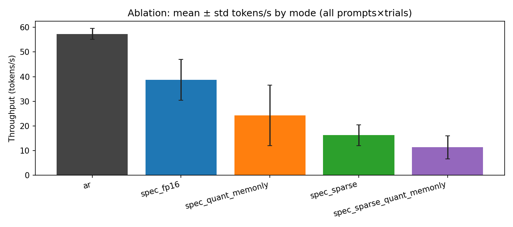

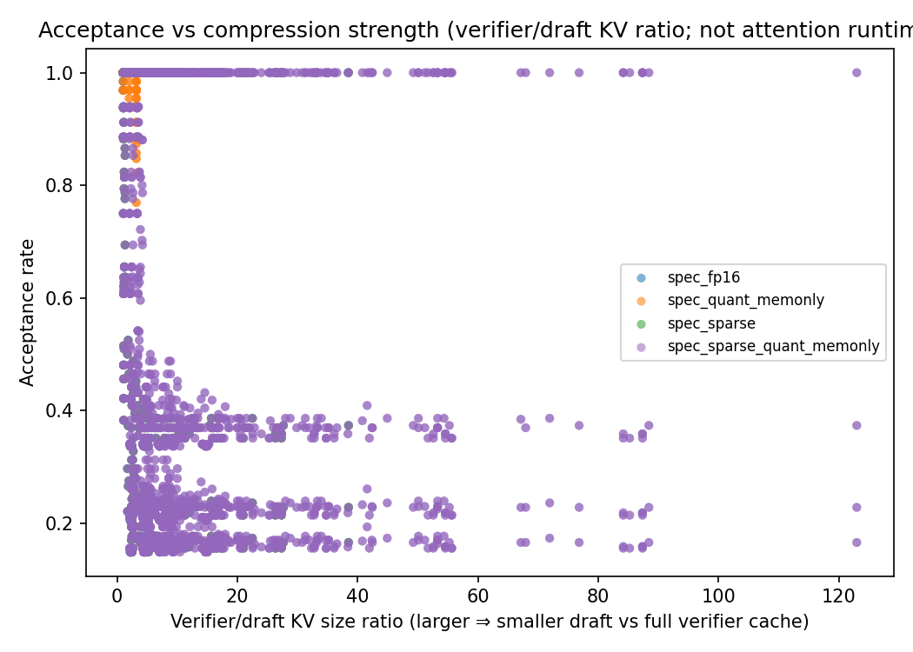

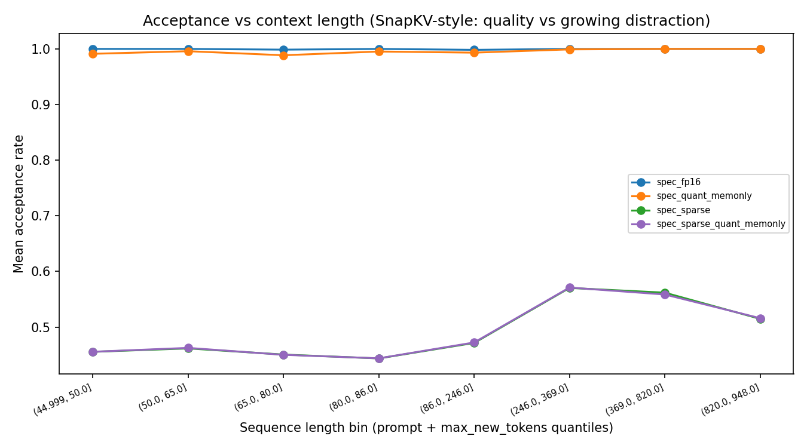

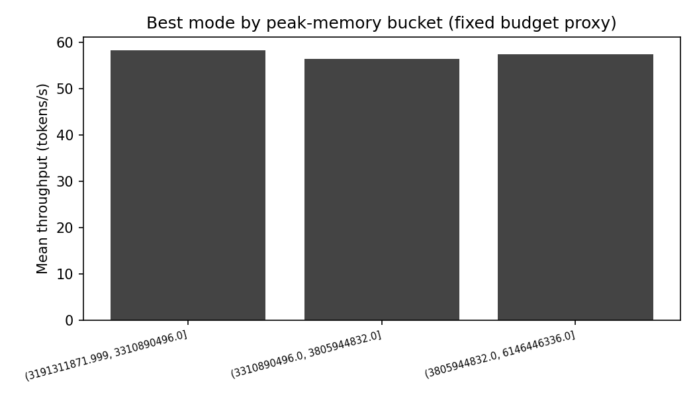

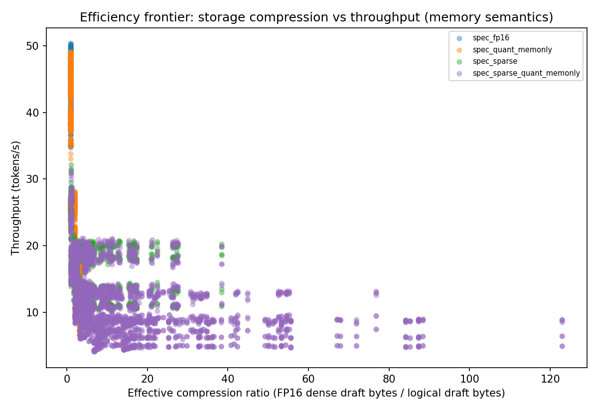

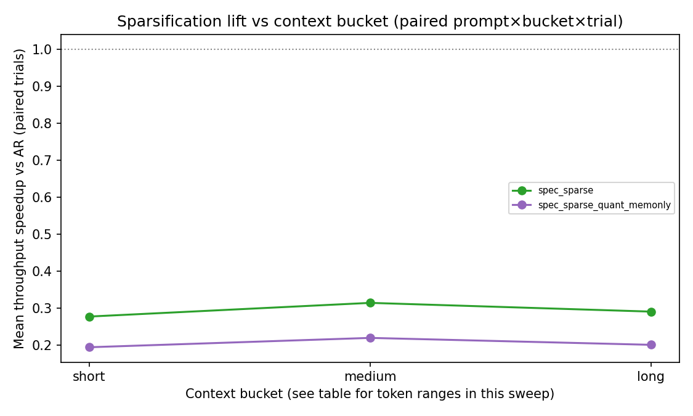

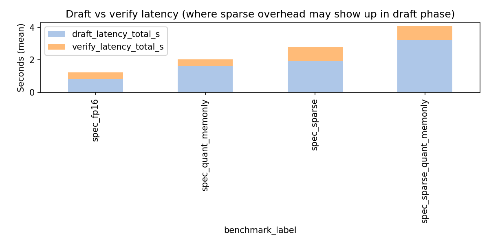

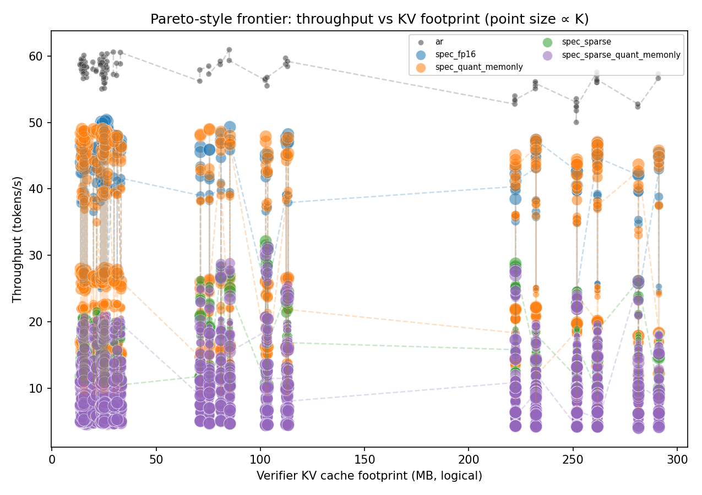

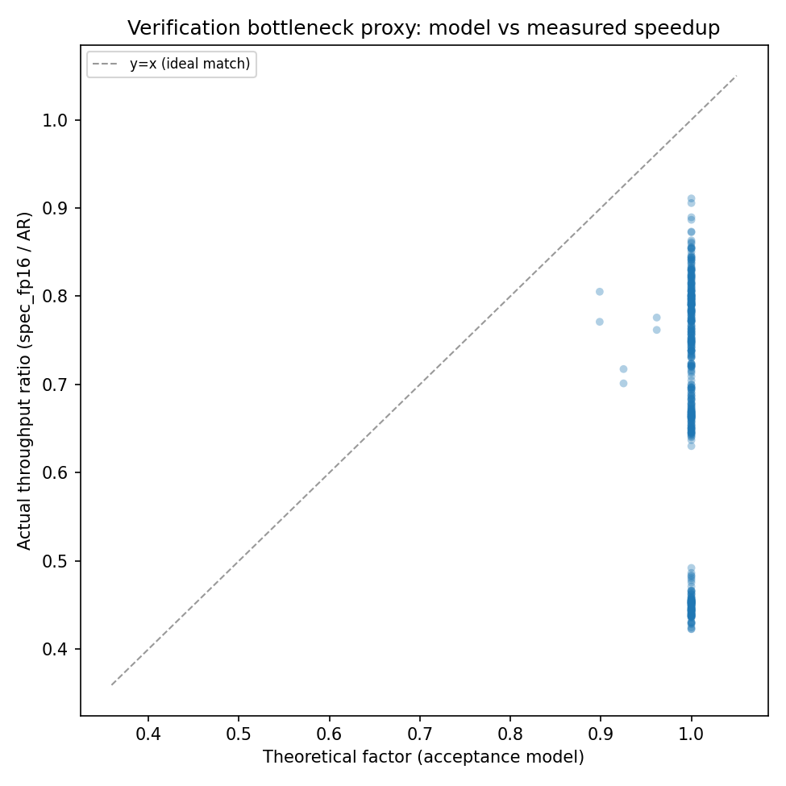

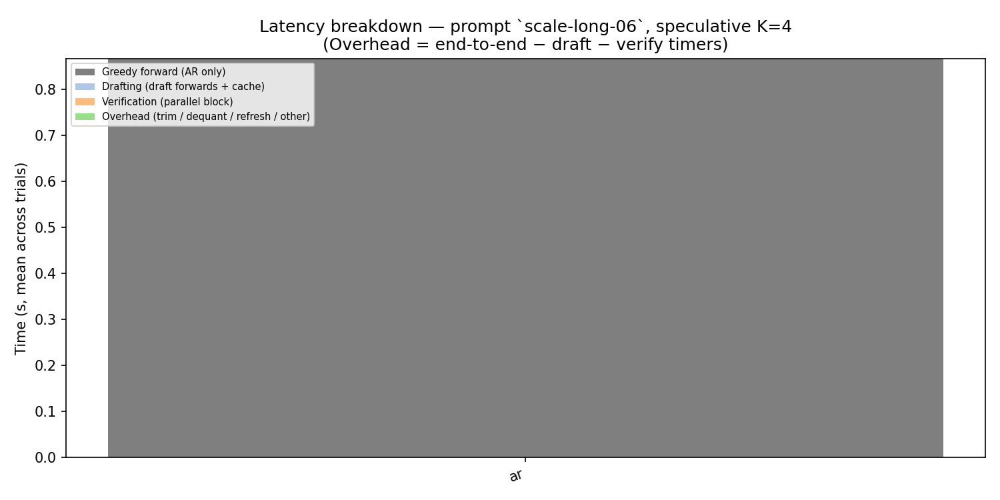

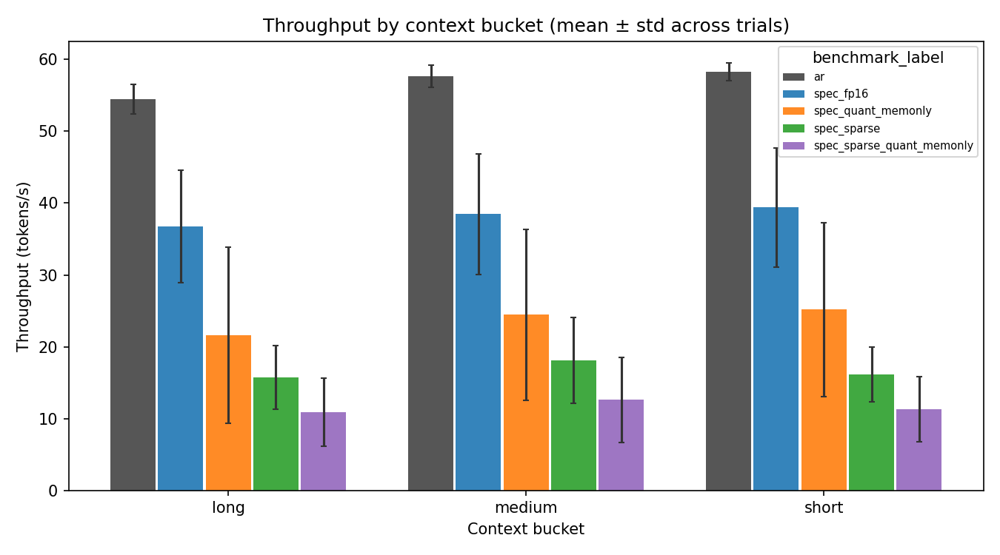

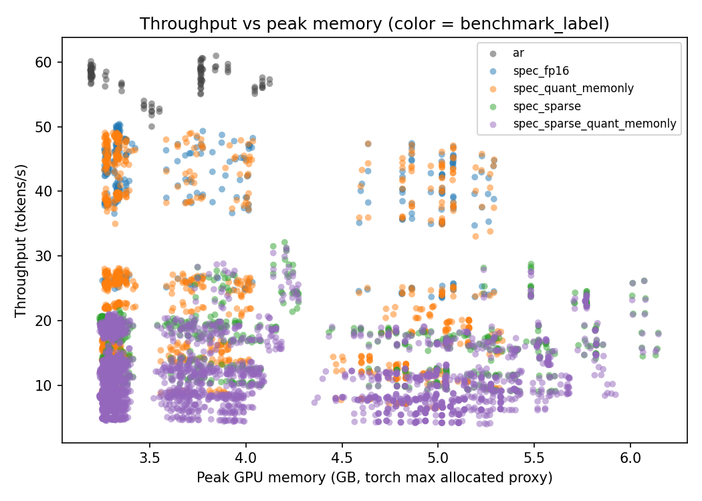

### Figure guide

| File | What it shows |
|------|----------------|
| `figures/pareto_throughput_vs_kv_mb.png` | **Paper core:** throughput vs **verifier KV (MB)**; color=mode; point size ∝ K; dashed lines connect sweep points per mode. |
| `figures/stacked_latency_single_prompt.png` | **Where time goes:** AR vs draft / verify / residual overhead for one long prompt. |
| `figures/acceptance_vs_sequence_length.png` | Acceptance vs binned **prompt+gen** length. |
| `figures/acceptance_vs_compression.png` | Acceptance vs **compression strength** (verifier/draft KV ratio). |
| `figures/throughput_by_context_bucket.png` | Throughput by **short/medium/long** with **±std** across trials. |
| `figures/best_throughput_under_memory_budget.png` | Best mode per **peak-VRAM tertile** (fixed budget proxy). |
| `figures/ablation_modes.png` | Global ablation with **error bars** (trial std). |
| `figures/throughput_vs_memory.png` | Tokens/s vs **peak torch memory** (hardware footprint). |
| `figures/compression_frontier_throughput.png` | **Compression frontier:** dense FP16 draft baseline / stored draft bytes vs throughput. |
| `figures/spec_fp16_theoretical_vs_actual_speedup.png` | **Verification model:** acceptance-based factor vs measured spec_fp16/AR ratio. |
| `figures/context_bucket_sparsification_lift.png` | Sparse modes: mean speedup vs AR by **context bucket**. |

## Interpretation (quantization + sparsity)

- **Joint effect (sparse + quant):** If `sparse_quant` acceptance is **materially lower** than `sparse_only` at the same (prompt, bucket, K, sparsity, trial), low-bit **memory-only** packing may be disturbing draft–verifier agreement — see `tables/joint_sparse_quant_vs_sparse_only.csv`.

- **Effective compression:** `effective_compression_ratio` = FP16 **dense draft** bytes (from `spec_fp16` at the same cell) divided by **logical** draft bytes. This maps **storage** compression to throughput; it does **not** claim faster attention unless `quantization_type` indicates runtime acceleration.

- **Verification bottleneck:** The scatter compares a simple **acceptance-based factor** to the measured **spec_fp16/AR** throughput ratio. Points **below** the y=x line suggest **system overhead** (draft/verify/sync, data movement) vs the idealized model.

- **Context buckets:** This sweep labels **short / medium / long** using YAML thresholds (see `tables/context_bucket_prompt_token_ranges.csv` for empirical token ranges in **this** CSV). Compare to fixed 512/1024 token cuts only if you re-bucket in post-processing.

## Separation of effects (honest)

- **Sparse-driven runtime:** draft latency fraction, acceptance vs length, sparse rows in tables.
- **Quantization-driven memory:** lower `logical_draft_kv_bytes` for Memory-Only INT KV; speed may not follow (dequant overhead).
- **True runtime gains:** only claim if `quantization_type` / metrics JSON indicate accelerated kernels (not default here).

## Failure-analysis summaries

### Acceptance loss

- **spec_sparse_quant_memonly** vs FP16 at prompt `mt-007`, K=7, bucket=short: drop **0.833** (FP16 1.000 → 0.167)
- **spec_sparse** vs FP16 at prompt `mt-007`, K=7, bucket=short: drop **0.832** (FP16 1.000 → 0.168)
- **spec_sparse** vs FP16 at prompt `mt-012`, K=7, bucket=short: drop **0.832** (FP16 1.000 → 0.168)
- **spec_sparse** vs FP16 at prompt `mt-003`, K=7, bucket=short: drop **0.832** (FP16 1.000 → 0.168)
- **spec_sparse_quant_memonly** vs FP16 at prompt `mt-012`, K=7, bucket=short: drop **0.832** (FP16 1.000 → 0.168)


### Sparse overhead

**Interpretation:** high draft fraction suggests **selector/refresh** cost dominates that regime.

- K=7.0, sparsity_budget=1.0: draft share of draft+verify = **0.80** (mean over prompts)
- K=7.0, sparsity_budget=0.4: draft share of draft+verify = **0.78** (mean over prompts)
- K=7.0, sparsity_budget=0.1: draft share of draft+verify = **0.78** (mean over prompts)


### Quantization overhead (memory-only vs FP16 spec)

- Mean **latency ratio** (memory-only quant / FP16 spec), aligned runs: **1.949**.
- Values **> 1** are expected when dequant + standard attention dominates; this is **not** a contradiction of memory-only KV benefits on **bytes moved**.


### Joint method tradeoffs

- Joint mode combines **sparse retention** (runtime: scoring/refresh) with **memory-only INT KV**.
- Attribute **speed** changes primarily to **sparsity**; attribute **KV bytes** to **both**.


## Detailed tables

### Mean acceptance by mode and K

| benchmark_label | spec_k | mean | std | count |
| --- | --- | --- | --- | --- |
| spec_fp16 | 1 | 1.0 | 0.0 | 100 |
| spec_fp16 | 3 | 1.0 | 0.0 | 100 |
| spec_fp16 | 5 | 0.9990625 | 0.004875744568884859 | 100 |
| spec_fp16 | 7 | 0.9993846153846154 | 0.004329393665731994 | 100 |
| spec_quant_memonly | 1 | 1.0 | 0.0 | 300 |
| spec_quant_memonly | 3 | 0.9966037781662781 | 0.011792004990260778 | 300 |
| spec_quant_memonly | 5 | 0.9945556658736554 | 0.024152620387191074 | 300 |
| spec_quant_memonly | 7 | 0.990132054280226 | 0.03253633136248328 | 300 |
| spec_sparse | 1 | 1.0 | 0.0 | 300 |
| spec_sparse | 3 | 0.4334112555509935 | 0.15763689202698275 | 300 |
| spec_sparse | 5 | 0.2956586496781364 | 0.17461416855712525 | 300 |
| spec_sparse | 7 | 0.23534893943031282 | 0.17989029963061892 | 300 |
| spec_sparse_quant_memonly | 1 | 1.0 | 0.0 | 900 |
| spec_sparse_quant_memonly | 3 | 0.4336757717064924 | 0.15849171375419888 | 900 |
| spec_sparse_quant_memonly | 5 | 0.296373817302693 | 0.17555901768338833 | 900 |
| spec_sparse_quant_memonly | 7 | 0.23425893432890993 | 0.17563914779104264 | 900 |


### Acceptance drops vs `spec_fp16`

| prompt_id | spec_k | context_bucket | reference_label | ref_acceptance | compare_label | compare_acceptance | acceptance_drop |
| --- | --- | --- | --- | --- | --- | --- | --- |
| mt-007 | 5 | short | spec_fp16 | 1.0 | spec_quant_memonly | 0.9465101108936725 | 0.05348988910632746 |
| mt-013 | 7 | short | spec_fp16 | 0.9846153846153847 | spec_quant_memonly | 0.930155290718671 | 0.05446009389671369 |
| mt-001 | 3 | short | spec_fp16 | 1.0 | spec_sparse | 0.37795565734812336 | 0.6220443426518767 |
| mt-001 | 5 | short | spec_fp16 | 1.0 | spec_sparse | 0.24175514800514797 | 0.758244851994852 |
| mt-001 | 7 | short | spec_fp16 | 1.0 | spec_sparse | 0.18514346950233643 | 0.8148565304976636 |
| mt-002 | 3 | short | spec_fp16 | 1.0 | spec_sparse | 0.3876887333704457 | 0.6123112666295543 |
| mt-002 | 5 | short | spec_fp16 | 1.0 | spec_sparse | 0.23171530495347492 | 0.7682846950465251 |
| mt-002 | 7 | short | spec_fp16 | 1.0 | spec_sparse | 0.1700017180433646 | 0.8299982819566354 |
| mt-003 | 3 | short | spec_fp16 | 1.0 | spec_sparse | 0.37795565734812336 | 0.6220443426518767 |
| mt-003 | 5 | short | spec_fp16 | 1.0 | spec_sparse | 0.22951472878522772 | 0.7704852712147723 |
| mt-003 | 7 | short | spec_fp16 | 1.0 | spec_sparse | 0.16845380005839009 | 0.8315461999416099 |
| mt-004 | 3 | short | spec_fp16 | 1.0 | spec_sparse | 0.38674669277255164 | 0.6132533072274484 |
| mt-004 | 5 | short | spec_fp16 | 1.0 | spec_sparse | 0.2440721822013768 | 0.7559278177986232 |
| mt-004 | 7 | short | spec_fp16 | 1.0 | spec_sparse | 0.18684234969868554 | 0.8131576503013145 |
| mt-005 | 3 | short | spec_fp16 | 1.0 | spec_sparse | 0.3841227865494801 | 0.6158772134505199 |
| mt-005 | 5 | short | spec_fp16 | 1.0 | spec_sparse | 0.24262764232353154 | 0.7573723576764685 |
| mt-005 | 7 | short | spec_fp16 | 1.0 | spec_sparse | 0.17823420439983115 | 0.8217657956001688 |
| mt-006 | 3 | short | spec_fp16 | 1.0 | spec_sparse | 0.39998458151957617 | 0.6000154184804238 |
| mt-006 | 5 | short | spec_fp16 | 1.0 | spec_sparse | 0.24558182248966012 | 0.7544181775103399 |
| mt-006 | 7 | short | spec_fp16 | 1.0 | spec_sparse | 0.184365904622227 | 0.815634095377773 |
| mt-007 | 3 | short | spec_fp16 | 1.0 | spec_sparse | 0.37236495388669294 | 0.6276350461133071 |
| mt-007 | 5 | short | spec_fp16 | 1.0 | spec_sparse | 0.22906546131991515 | 0.7709345386800849 |
| mt-007 | 7 | short | spec_fp16 | 1.0 | spec_sparse | 0.16791132478632476 | 0.8320886752136752 |
| mt-008 | 3 | short | spec_fp16 | 1.0 | spec_sparse | 0.37795565734812336 | 0.6220443426518767 |
| mt-008 | 5 | short | spec_fp16 | 1.0 | spec_sparse | 0.23799357393107387 | 0.7620064260689261 |
| mt-008 | 7 | short | spec_fp16 | 1.0 | spec_sparse | 0.17483644400713286 | 0.8251635559928672 |
| mt-009 | 3 | short | spec_fp16 | 1.0 | spec_sparse | 0.3856143856143856 | 0.6143856143856143 |
| mt-009 | 5 | short | spec_fp16 | 1.0 | spec_sparse | 0.23270376672163226 | 0.7672962332783677 |
| mt-009 | 7 | short | spec_fp16 | 1.0 | spec_sparse | 0.1702638474088822 | 0.8297361525911178 |
| mt-010 | 3 | short | spec_fp16 | 1.0 | spec_sparse | 0.3892929927370572 | 0.6107070072629428 |
| mt-010 | 5 | short | spec_fp16 | 1.0 | spec_sparse | 0.23918285404249898 | 0.760817145957501 |
| mt-010 | 7 | short | spec_fp16 | 1.0 | spec_sparse | 0.1792360236455142 | 0.8207639763544858 |
| mt-011 | 3 | short | spec_fp16 | 1.0 | spec_sparse | 0.4047065739138909 | 0.5952934260861091 |
| mt-011 | 5 | short | spec_fp16 | 1.0 | spec_sparse | 0.2548841635302537 | 0.7451158364697463 |
| mt-011 | 7 | short | spec_fp16 | 1.0 | spec_sparse | 0.18724895004185638 | 0.8127510499581436 |
| mt-012 | 3 | short | spec_fp16 | 1.0 | spec_sparse | 0.369985703473215 | 0.630014296526785 |
| mt-012 | 5 | short | spec_fp16 | 1.0 | spec_sparse | 0.22951472878522772 | 0.7704852712147723 |
| mt-012 | 7 | short | spec_fp16 | 1.0 | spec_sparse | 0.16845380005839009 | 0.8315461999416099 |
| mt-013 | 3 | short | spec_fp16 | 1.0 | spec_sparse | 0.39299680430577744 | 0.6070031956942226 |
| mt-013 | 5 | short | spec_fp16 | 0.9765625 | spec_sparse | 0.2387031292763908 | 0.7378593707236092 |
| mt-013 | 7 | short | spec_fp16 | 0.9846153846153847 | spec_sparse | 0.17520883725440198 | 0.8094065473609827 |
| mt-014 | 3 | short | spec_fp16 | 1.0 | spec_sparse | 0.38366312817187326 | 0.6163368718281268 |
| mt-014 | 5 | short | spec_fp16 | 1.0 | spec_sparse | 0.23304875595508798 | 0.766951244044912 |
| mt-014 | 7 | short | spec_fp16 | 1.0 | spec_sparse | 0.17483644400713286 | 0.8251635559928672 |
| mt-015 | 3 | short | spec_fp16 | 1.0 | spec_sparse | 0.41533412911450535 | 0.5846658708854946 |
| mt-015 | 5 | short | spec_fp16 | 1.0 | spec_sparse | 0.26615329745537325 | 0.7338467025446267 |
| mt-015 | 7 | short | spec_fp16 | 1.0 | spec_sparse | 0.19223860424690456 | 0.8077613957530955 |
| mt-long-01 | 3 | short | spec_fp16 | 1.0 | spec_sparse | 0.5546055631554948 | 0.4453944368445052 |
| mt-long-01 | 5 | short | spec_fp16 | 1.0 | spec_sparse | 0.4054611124258092 | 0.5945388875741908 |
| mt-long-01 | 7 | short | spec_fp16 | 1.0 | spec_sparse | 0.32524552096409404 | 0.6747544790359059 |
| mt-long-02 | 3 | short | spec_fp16 | 1.0 | spec_sparse | 0.5168412305344908 | 0.4831587694655092 |
| mt-long-02 | 5 | short | spec_fp16 | 1.0 | spec_sparse | 0.3796638401901559 | 0.620336159809844 |
| mt-long-02 | 7 | short | spec_fp16 | 1.0 | spec_sparse | 0.29080395715946855 | 0.7091960428405315 |
| scale-long-01 | 3 | long | spec_fp16 | 1.0 | spec_sparse | 0.48327170184416063 | 0.5167282981558394 |
| scale-long-01 | 5 | long | spec_fp16 | 1.0 | spec_sparse | 0.36629875971981235 | 0.6337012402801876 |
| scale-long-01 | 7 | long | spec_fp16 | 1.0 | spec_sparse | 0.321760078274846 | 0.678239921725154 |
| scale-long-02 | 3 | long | spec_fp16 | 1.0 | spec_sparse | 0.48327170184416063 | 0.5167282981558394 |
| scale-long-02 | 5 | long | spec_fp16 | 1.0 | spec_sparse | 0.36629875971981235 | 0.6337012402801876 |
| scale-long-02 | 7 | long | spec_fp16 | 1.0 | spec_sparse | 0.321760078274846 | 0.678239921725154 |
| scale-long-03 | 3 | long | spec_fp16 | 1.0 | spec_sparse | 0.49529338678670437 | 0.5047066132132956 |
| scale-long-03 | 5 | long | spec_fp16 | 1.0 | spec_sparse | 0.3767559609664872 | 0.6232440390335128 |
| scale-long-03 | 7 | long | spec_fp16 | 1.0 | spec_sparse | 0.30022083263197397 | 0.699779167368026 |
| scale-long-04 | 3 | long | spec_fp16 | 1.0 | spec_sparse | 0.49049860351090846 | 0.5095013964890915 |
| scale-long-04 | 5 | long | spec_fp16 | 1.0 | spec_sparse | 0.3710255802361065 | 0.6289744197638936 |
| scale-long-04 | 7 | long | spec_fp16 | 1.0 | spec_sparse | 0.30022083263197397 | 0.699779167368026 |
| scale-long-05 | 3 | long | spec_fp16 | 1.0 | spec_sparse | 0.49049860351090846 | 0.5095013964890915 |
| scale-long-05 | 5 | long | spec_fp16 | 1.0 | spec_sparse | 0.3710255802361065 | 0.6289744197638936 |
| scale-long-05 | 7 | long | spec_fp16 | 1.0 | spec_sparse | 0.30022083263197397 | 0.699779167368026 |
| scale-long-06 | 3 | long | spec_fp16 | 1.0 | spec_sparse | 0.47619023001492256 | 0.5238097699850774 |
| scale-long-06 | 5 | long | spec_fp16 | 1.0 | spec_sparse | 0.36629875971981235 | 0.6337012402801876 |
| scale-long-06 | 7 | long | spec_fp16 | 1.0 | spec_sparse | 0.3339813867543781 | 0.6660186132456218 |
| scale-med-01 | 3 | medium | spec_fp16 | 1.0 | spec_sparse | 0.5180358213392928 | 0.4819641786607072 |
| scale-med-01 | 5 | medium | spec_fp16 | 1.0 | spec_sparse | 0.3952975387185913 | 0.6047024612814087 |
| scale-med-01 | 7 | medium | spec_fp16 | 1.0 | spec_sparse | 0.3625485249884321 | 0.6374514750115678 |
| scale-med-02 | 3 | medium | spec_fp16 | 1.0 | spec_sparse | 0.5204061087599722 | 0.4795938912400278 |
| scale-med-02 | 5 | medium | spec_fp16 | 1.0 | spec_sparse | 0.3968237902448428 | 0.6031762097551572 |
| scale-med-02 | 7 | medium | spec_fp16 | 1.0 | spec_sparse | 0.3636857196644596 | 0.6363142803355404 |
| mt-001 | 3 | short | spec_fp16 | 1.0 | spec_sparse_quant_memonly | 0.37795565734812336 | 0.6220443426518767 |
| mt-001 | 5 | short | spec_fp16 | 1.0 | spec_sparse_quant_memonly | 0.24175514800514797 | 0.758244851994852 |
| mt-001 | 7 | short | spec_fp16 | 1.0 | spec_sparse_quant_memonly | 0.18514346950233643 | 0.8148565304976636 |

*(Showing first 80 of 152 rows.)*


### Sparse draft-latency share

| spec_k | sparsity_budget | draft_latency_fraction | compression_ratio_verifier_over_draft | acceptance_rate | n |
| --- | --- | --- | --- | --- | --- |
| 1.0 | 0.1 | 0.5210692468803014 | 13.077342332972657 | 1.0 | 100.0 |
| 1.0 | 0.4 | 0.5243232548822636 | 5.48826099339508 | 1.0 | 100.0 |
| 1.0 | 1.0 | 0.5289557156602409 | 2.497548868489465 | 1.0 | 100.0 |
| 3.0 | 0.1 | 0.6066681530503837 | 13.077342332972657 | 0.36291398183146145 | 100.0 |
| 3.0 | 0.4 | 0.6121188931740047 | 5.48826099339508 | 0.36076364869412797 | 100.0 |
| 3.0 | 1.0 | 0.6569618458499177 | 2.497548868489465 | 0.576556136127391 | 100.0 |
| 5.0 | 0.1 | 0.7160876046657149 | 13.077342332972657 | 0.22332471594876022 | 100.0 |
| 5.0 | 0.4 | 0.7207629680194017 | 5.48826099339508 | 0.22191948116127658 | 100.0 |
| 5.0 | 1.0 | 0.7539226304511197 | 2.497548868489465 | 0.44173175192437225 | 100.0 |
| 7.0 | 0.1 | 0.775006142212461 | 13.077342332972657 | 0.16366542235312495 | 100.0 |
| 7.0 | 0.4 | 0.7792128789889466 | 5.48826099339508 | 0.16260914334607343 | 100.0 |
| 7.0 | 1.0 | 0.8023019613109029 | 2.497548868489465 | 0.3797722525917402 | 100.0 |


### FP16 vs memory-only quant (pivot)

| prompt_id | spec_k | context_bucket | latency_per_new_token_s_spec_fp16 | latency_per_new_token_s_spec_quant_memonly | logical_draft_kv_bytes_spec_fp16 | logical_draft_kv_bytes_spec_quant_memonly | memory_throughput_gb_s_spec_fp16 | memory_throughput_gb_s_spec_quant_memonly | tokens_per_sec_spec_fp16 | tokens_per_sec_spec_quant_memonly |
| --- | --- | --- | --- | --- | --- | --- | --- | --- | --- | --- |
| mt-001 | 1 | short | 0.03778285237889695 | 0.0719387852447918 | 21811200.0 | 13177728.0 | 83.09177129668858 | 52.07241882110446 | 26.486440624625764 | 16.59894414928696 |
| mt-001 | 3 | short | 0.025656606433593625 | 0.04726064372914603 | 21811200.0 | 13177728.0 | 122.34390055176745 | 79.34606005151792 | 38.99851734513748 | 25.292380917788847 |
| mt-001 | 5 | short | 0.021990480105467926 | 0.04189627984503844 | 21811200.0 | 13177728.0 | 143.0344378570449 | 88.24042498823324 | 45.59184907896172 | 28.128608980061937 |
| mt-001 | 7 | short | 0.021106398472653574 | 0.038841402989561354 | 21811200.0 | 13177728.0 | 148.8164473491514 | 95.55152585094447 | 47.436049920448546 | 30.459096237354327 |
| mt-002 | 1 | short | 0.03820677971094285 | 0.07211339789195863 | 20275200.0 | 12249728.0 | 82.10882453893007 | 51.87920866913537 | 26.185978493107637 | 16.545436923645962 |
| mt-002 | 3 | short | 0.025515363800781427 | 0.04847882777475352 | 20275200.0 | 12249728.0 | 122.90644500618205 | 77.52127534189769 | 39.198300778547875 | 24.72331763211336 |
| mt-002 | 5 | short | 0.022224140644533773 | 0.041502461839845205 | 20275200.0 | 12249728.0 | 141.45694976754214 | 90.75136724167372 | 45.11111066597494 | 28.942661735698437 |
| mt-002 | 7 | short | 0.02126794814452545 | 0.039620801118483415 | 20275200.0 | 12249728.0 | 147.80042554108812 | 95.43443005946466 | 47.134278720032285 | 30.436397762308076 |
| mt-003 | 1 | short | 0.03792426702344405 | 0.07196179271875275 | 21811200.0 | 13177728.0 | 82.77793365390299 | 52.16118257413584 | 26.386260557150045 | 16.62725602983488 |
| mt-003 | 3 | short | 0.0254950444140602 | 0.04775025829296923 | 21811200.0 | 13177728.0 | 123.13233359775766 | 78.30980880984137 | 39.249621012796986 | 24.962724788921278 |
| mt-003 | 5 | short | 0.022397820808583477 | 0.041324934770822545 | 21811200.0 | 13177728.0 | 140.2729691540316 | 90.87795107190429 | 44.71250817104055 | 28.969090638599198 |
| mt-003 | 7 | short | 0.021025356558606427 | 0.038616383623690305 | 21811200.0 | 13177728.0 | 149.4811232525172 | 96.55504797629506 | 47.64735540290452 | 30.778564003894143 |
| mt-004 | 1 | short | 0.03790788804687455 | 0.07218722308334688 | 20889600.0 | 12620928.0 | 82.75806168129787 | 51.978938271344504 | 26.388112124120035 | 16.574074440317126 |
| mt-004 | 3 | short | 0.025885667335927075 | 0.04762497968358537 | 20889600.0 | 12620928.0 | 121.16901150942064 | 78.56597111987965 | 38.63611588341745 | 25.051815303696255 |
| mt-004 | 5 | short | 0.0221093966757788 | 0.04167065356381269 | 20889600.0 | 12620928.0 | 142.0784450103219 | 89.62682321514824 | 45.301196780898266 | 28.578321342630044 |
| mt-004 | 7 | short | 0.0207461110820279 | 0.039042011261718274 | 20889600.0 | 12620928.0 | 151.3376184174193 | 95.38266410756778 | 48.25400272616878 | 30.414247374666854 |
| mt-005 | 1 | short | 0.03819232508202082 | 0.07220614054688208 | 21196800.0 | 12806528.0 | 82.17455529974896 | 51.91014882240492 | 26.19962044925881 | 16.550438395135746 |
| mt-005 | 3 | short | 0.025556618175781552 | 0.04733333492446448 | 21196800.0 | 12806528.0 | 122.82105117283238 | 78.68101443201368 | 39.157996185711674 | 25.08578866470744 |
| mt-005 | 5 | short | 0.022139290863282875 | 0.04172998944792041 | 21196800.0 | 12806528.0 | 141.93630037389727 | 90.09321505525308 | 45.25127485971551 | 28.724483817374537 |
| mt-005 | 7 | short | 0.021070255316398126 | 0.03967833445312858 | 21196800.0 | 12806528.0 | 149.15991216712058 | 94.95203122753675 | 47.554206794166866 | 30.273363483921838 |
| mt-006 | 1 | short | 0.03841962531642103 | 0.0717303708294423 | 20275200.0 | 12249728.0 | 81.62344407486177 | 52.01178912087673 | 26.031787866252557 | 16.587767681121623 |
| mt-006 | 3 | short | 0.02550117044530205 | 0.047081327865896534 | 20275200.0 | 12249728.0 | 123.12316287434462 | 78.98710488092827 | 39.26527985941274 | 25.190778175765903 |
| mt-006 | 5 | short | 0.022176171937497928 | 0.04136709739062396 | 20275200.0 | 12249728.0 | 141.73892615632676 | 90.071354459541 | 45.20118488848297 | 28.725824226426024 |
| mt-006 | 7 | short | 0.020832756335924876 | 0.03907714138411692 | 20275200.0 | 12249728.0 | 150.65892454307084 | 96.25621260798977 | 48.0471359765343 | 30.698900189710624 |
| mt-007 | 1 | short | 0.03769816841796378 | 0.07198556477603306 | 19660800.0 | 11878528.0 | 83.16580072840506 | 51.83653781013027 | 26.528770851389574 | 16.535132535469536 |
| mt-007 | 3 | short | 0.025571128296875523 | 0.04696208605339314 | 19660800.0 | 11878528.0 | 122.66186089450102 | 79.4182100408813 | 39.12674109726378 | 25.333618684860095 |
| mt-007 | 5 | short | 0.0222339656679686 | 0.04368297249478317 | 19660800.0 | 11878528.0 | 141.2005261276285 | 89.06215733937738 | 45.039231720618474 | 28.409897806399773 |
| mt-007 | 7 | short | 0.021068413324203776 | 0.04054675158986729 | 19660800.0 | 11878528.0 | 149.03196212038267 | 95.19389763244834 | 47.53701020774282 | 30.366060437800552 |
| mt-008 | 1 | short | 0.037962304386712074 | 0.07245180014581361 | 19353600.0 | 11692928.0 | 82.6164682734887 | 51.64281886231365 | 26.35557619542855 | 16.474885153609453 |
| mt-008 | 3 | short | 0.025630238410154726 | 0.04726124377343879 | 19353600.0 | 11692928.0 | 122.35552050706835 | 79.09500342162006 | 39.03294383820472 | 25.23283460454209 |
| mt-008 | 5 | short | 0.0223765472578092 | 0.04106883060544909 | 19353600.0 | 11692928.0 | 140.36071414917825 | 90.93177558210478 | 44.77519442394628 | 29.009077344761838 |
| mt-008 | 7 | short | 0.021260051488280973 | 0.038875725888033195 | 19353600.0 | 11692928.0 | 147.6257032775846 | 95.82363467418735 | 47.093432499076776 | 30.569487583822987 |
| mt-009 | 1 | short | 0.03804720216404697 | 0.07226641739974102 | 18739200.0 | 11321728.0 | 82.39178375193725 | 51.718033855564755 | 26.289488524806693 | 16.502254500929777 |
| mt-009 | 3 | short | 0.025606740976568752 | 0.04696915458202961 | 18739200.0 | 11321728.0 | 122.50524352145831 | 79.13247676619972 | 39.08783672692208 | 25.249653410394696 |
| mt-009 | 5 | short | 0.022404547792957474 | 0.04155429457422121 | 18739200.0 | 11321728.0 | 140.16146565368928 | 90.13814598642635 | 44.720462263059915 | 28.76104323783099 |
| mt-009 | 7 | short | 0.0211081485195414 | 0.038675194960935196 | 18739200.0 | 11321728.0 | 148.8864322802343 | 96.50980917246001 | 47.50385106937907 | 30.794841600014916 |
| mt-010 | 1 | short | 0.038356200800795354 | 0.07222167394272101 | 19353600.0 | 11692928.0 | 81.74955311617214 | 52.07912236167226 | 26.079318359138394 | 16.61392383135067 |
| mt-010 | 3 | short | 0.02533959499609835 | 0.04700769979427829 | 19353600.0 | 11692928.0 | 123.84122081389185 | 78.905402766579 | 39.50615947138428 | 25.17213989037238 |
| mt-010 | 5 | short | 0.022327991984376124 | 0.04142557150392647 | 19353600.0 | 11692928.0 | 140.60078938027678 | 90.11600679879909 | 44.85217666982956 | 28.748467315262914 |
| mt-010 | 7 | short | 0.020839727691403576 | 0.03860828073176014 | 19353600.0 | 11692928.0 | 150.6392734575744 | 97.01329107518586 | 48.05445157437792 | 30.949406491905787 |
| mt-011 | 1 | short | 0.03814318944140055 | 0.07210798012110327 | 20582400.0 | 12435328.0 | 82.28428013454484 | 52.05778992393746 | 26.23905968872915 | 16.600825446491015 |
| mt-011 | 3 | short | 0.025387364398430777 | 0.04713298081769793 | 20582400.0 | 12435328.0 | 123.60577204561183 | 78.45155448186185 | 39.41606090523632 | 25.01725758212388 |
| mt-011 | 5 | short | 0.022195599179689777 | 0.04149889605340221 | 20582400.0 | 12435328.0 | 141.52813558774125 | 90.61871435821489 | 45.13008950773457 | 28.89757667481983 |
| mt-011 | 7 | short | 0.021062487972653924 | 0.03881553539974898 | 20582400.0 | 12435328.0 | 149.0733586857916 | 96.56523085062993 | 47.53684918160639 | 30.794200682294175 |
| mt-012 | 1 | short | 0.03828758646093085 | 0.0728811075442763 | 20275200.0 | 12249728.0 | 81.94038313018844 | 51.40649849765586 | 26.132372251466123 | 16.394824393108205 |
| mt-012 | 3 | short | 0.025241564371085226 | 0.0475756018307246 | 20275200.0 | 12249728.0 | 124.40745322347055 | 78.51608314305504 | 39.674784507634904 | 25.0403139879284 |
| mt-012 | 5 | short | 0.022355773187504327 | 0.04282128381121685 | 20275200.0 | 12249728.0 | 140.5066261792364 | 89.32127250338662 | 44.80868559823109 | 28.486445584587255 |
| mt-012 | 7 | short | 0.021237796496079875 | 0.04043479661197575 | 20275200.0 | 12249728.0 | 147.74992507022526 | 95.27680386651747 | 47.11973750221172 | 30.38612240188859 |
| mt-013 | 1 | short | 0.038555511785154775 | 0.07168310652863848 | 28262400.0 | 17075328.0 | 81.64081608544397 | 52.62973495748804 | 25.96999061466983 | 16.74205648843171 |
| mt-013 | 3 | short | 0.025202176886721397 | 0.047269290666671744 | 28262400.0 | 17075328.0 | 124.9186290538504 | 79.2098989155656 | 39.73658369631551 | 25.19759591188819 |
| mt-013 | 5 | short | 0.02280210963281075 | 0.04306450185158416 | 28262400.0 | 17075328.0 | 138.14048393169872 | 87.92548997884599 | 43.941999558191156 | 27.970333002369216 |
| mt-013 | 7 | short | 0.02171464769140645 | 0.042839740967432684 | 28262400.0 | 17075328.0 | 144.85454659912062 | 92.46674620438246 | 46.0794252771 | 29.415871317751996 |
| mt-014 | 1 | short | 0.03798047795312915 | 0.07270232764451139 | 24883200.0 | 15033728.0 | 82.68351559709242 | 51.73736833194598 | 26.3313680713406 | 16.476079188653987 |
| mt-014 | 3 | short | 0.0254867282617139 | 0.04773762498438331 | 24883200.0 | 15033728.0 | 123.5163012198019 | 78.37540519946663 | 39.332452088388955 | 24.958995934507197 |
| mt-014 | 5 | short | 0.02199845644922235 | 0.041461971936181834 | 24883200.0 | 15033728.0 | 143.19239643152207 | 90.1089871881402 | 45.59720925877337 | 28.696059049721793 |
| mt-014 | 7 | short | 0.0216263694335827 | 0.0404822883489354 | 24883200.0 | 15033728.0 | 145.40281406970445 | 94.97003367941119 | 46.30240787124587 | 30.244469138308144 |
| mt-015 | 1 | short | 0.03808050110156942 | 0.07229020441147321 | 26419200.0 | 15961728.0 | 82.51785867340533 | 52.15051609729746 | 26.26537466583274 | 16.59980514095522 |
| mt-015 | 3 | short | 0.025422601039065428 | 0.047194305776031294 | 26419200.0 | 15961728.0 | 123.70248694742176 | 77.7910716805387 | 39.373375718195305 | 24.76034292841423 |
| mt-015 | 5 | short | 0.022885343687512674 | 0.04142462306771217 | 26419200.0 | 15961728.0 | 137.56697483608357 | 90.34912398262253 | 43.78542402226326 | 28.757936102132792 |
| mt-015 | 7 | short | 0.02129136948437345 | 0.039183481217463574 | 26419200.0 | 15961728.0 | 147.60194869417163 | 96.27099796603085 | 46.98117833031894 | 30.64333528348268 |
| mt-long-01 | 1 | short | 0.038257981242186774 | 0.07373311288149385 | 76185600.0 | 46028928.0 | 83.4648444730796 | 52.057317718817934 | 26.152254515362053 | 16.31154543622743 |
| mt-long-01 | 3 | short | 0.025340750316408 | 0.04795832651303533 | 76185600.0 | 46028928.0 | 126.0176955608051 | 79.39798852318917 | 39.48526458783568 | 24.87800926089567 |
| mt-long-01 | 5 | short | 0.02268190101951355 | 0.04192551241667763 | 76185600.0 | 46028928.0 | 140.94638441060943 | 91.0976062336917 | 44.16192112265837 | 28.54327751658072 |
| mt-long-01 | 7 | short | 0.021343802437506474 | 0.04170198056640587 | 76185600.0 | 46028928.0 | 149.60131043193013 | 94.99542956365792 | 46.874839277822936 | 29.76546252099557 |
| mt-long-02 | 1 | short | 0.03823593011718035 | 0.07331208899867643 | 80486400.0 | 48627328.0 | 83.62430605776422 | 52.536241681337366 | 26.166791626730223 | 16.439445970989542 |
| mt-long-02 | 3 | short | 0.02563770760937515 | 0.04829989569398657 | 80486400.0 | 48627328.0 | 124.66982427021041 | 78.96191089069 | 39.01113692127639 | 24.70835478260084 |
| mt-long-02 | 5 | short | 0.022823171363280673 | 0.042352492858062335 | 80486400.0 | 48627328.0 | 140.4332755007659 | 90.77054831047921 | 43.94074725602116 | 28.402348293694804 |
| mt-long-02 | 7 | short | 0.02125231161719295 | 0.039768496575523636 | 80486400.0 | 48627328.0 | 150.5074162160696 | 97.04580069367832 | 47.09485872182476 | 30.367816412920224 |
| scale-long-01 | 1 | long | 0.04058902240234058 | 0.08402581974477619 | 227328000.0 | 137344128.0 | 82.36437781156111 | 49.42010051735138 | 24.64079992031988 | 14.78497562590124 |
| scale-long-01 | 3 | long | 0.027648792187489876 | 0.05477299738799952 | 227328000.0 | 137344128.0 | 121.02899321813632 | 74.44771893659235 | 36.20737489610961 | 22.2724613725009 |
| scale-long-01 | 5 | long | 0.0238343525937567 | 0.04844111184896364 | 227328000.0 | 137344128.0 | 140.55359813508124 | 85.44600104447562 | 42.04704192867406 | 25.562016196785326 |
| scale-long-01 | 7 | long | 0.022515321242189523 | 0.045737896040359695 | 227328000.0 | 137344128.0 | 148.95617575734724 | 90.82767579085602 | 44.56005437384832 | 27.172247651492025 |
| scale-long-02 | 1 | long | 0.04058779933593733 | 0.08380922641536391 | 227328000.0 | 137344128.0 | 82.37595295134858 | 49.37246185749786 | 24.64408537204585 | 14.770931195564316 |
| scale-long-02 | 3 | long | 0.0273995412109453 | 0.05477604200129343 | 227328000.0 | 137344128.0 | 122.07881342670721 | 75.07240806435276 | 36.52148523037546 | 22.45905383988614 |
| scale-long-02 | 5 | long | 0.02351442985547165 | 0.04829205882941773 | 227328000.0 | 137344128.0 | 142.70570416204734 | 85.69652228713257 | 42.68981496459178 | 25.6374734704776 |
| scale-long-02 | 7 | long | 0.022993354582033478 | 0.045429297356775984 | 227328000.0 | 137344128.0 | 146.47451862740644 | 91.50279055693896 | 43.81608853865798 | 27.374645150677008 |
| scale-long-03 | 1 | long | 0.0407641683633026 | 0.0912367868853986 | 256819200.0 | 155161728.0 | 82.85622924144414 | 47.73124592595065 | 24.570120222495845 | 14.15502014280604 |
| scale-long-03 | 3 | long | 0.0277244311562414 | 0.05943126879820202 | 256819200.0 | 155161728.0 | 121.75258771728946 | 72.01648028560702 | 36.104839616153406 | 21.356396673486504 |
| scale-long-03 | 5 | long | 0.0236619886288984 | 0.052442395001330966 | 256819200.0 | 155161728.0 | 143.01197845565906 | 81.91847870013187 | 42.40748263582257 | 24.29226114050618 |
| scale-long-03 | 7 | long | 0.022708662167969 | 0.04929840669401145 | 256819200.0 | 155161728.0 | 148.64680716029716 | 87.71830064791935 | 44.08012290297579 | 26.01244296798978 |

*(Showing first 80 of 100 rows.)*


### Best throughput under memory tertiles

| mem_bucket | best_benchmark_label | mean_tokens_per_sec | runner_up_label | runner_up_tps |
| --- | --- | --- | --- | --- |
| (3191311871.999, 3310890496.0] | ar | 58.28346386384977 | spec_fp16 | 38.12948306079223 |
| (3310890496.0, 3805944832.0] | ar | 56.525914496349344 | spec_fp16 | 40.05644066958022 |
| (3805944832.0, 6146446336.0] | ar | 57.50656454302007 | spec_fp16 | 37.4297342517771 |


### Joint vs components

| benchmark_label | mean_tokens_per_sec | mean_draft_kv_bytes | mean_acceptance | n |
| --- | --- | --- | --- | --- |
| spec_quant_memonly | 24.258980733302906 | 53356416.0 | 0.9953228745800399 | 1200 |
| spec_sparse | 16.205988449698193 | 42150111.52 | 0.49110471116486065 | 1200 |
| spec_sparse_quant_memonly | 11.309762778191741 | 25466719.52 | 0.4910771308345238 | 3600 |


### Joint sparse×quant vs sparse-only (acceptance)

| quant_bits_effective | n_paired_rows | mean_acceptance_sparse_only | mean_acceptance_sparse_quant | mean_delta_sparse_only_minus_joint | std_delta | p_value_delta_eq_0 | notes |
| --- | --- | --- | --- | --- | --- | --- | --- |
| 4 | 1200 | 0.4911047111648607 | 0.4913830549802475 | -0.0002783438153867639 | 0.014686692174159674 | 0.5116153423309293 | H0: delta=0; paired cells (prompt×bucket×K×sparsity×trial) |
| 8 | 1200 | 0.4911047111648607 | 0.4907436263584634 | 0.0003610848063973066 | 0.0078065407401229645 | 0.10935482244818057 | H0: delta=0; paired cells (prompt×bucket×K×sparsity×trial) |
| 16 | 1200 | 0.4911047111648607 | 0.4911047111648607 | 0.0 | 0.0 | nan | H0: delta=0; paired cells (prompt×bucket×K×sparsity×trial) |


### Effective compression ratio (rows + by-mode means)

| benchmark_label | mean_effective_compression | std_effective_compression | mean_tokens_per_sec | n |
| --- | --- | --- | --- | --- |
| spec_fp16 | 1.0 | 0.0 | 38.70264003344058 | 400 |
| spec_quant_memonly | 2.066650004873981 | 0.8997587174209517 | 24.258980733302906 | 1200 |
| spec_sparse | 7.021050731619067 | 7.034629118065264 | 16.205988449698193 | 1200 |
| spec_sparse_quant_memonly | 14.503162884688214 | 17.046920415500722 | 11.309762778191741 | 3600 |


*Full row-level table:* `tables/effective_compression_ratio_rows.csv`.

### Verification bottleneck (spec_fp16 vs AR)

| spec_k | n | mean_actual_ratio | mean_theoretical | mean_overhead_ratio | median_overhead_ratio |
| --- | --- | --- | --- | --- | --- |
| 1.0 | 100.0 | 0.44988147142012336 | 1.0 | 0.44988147142012336 | 0.449878089760988 |
| 3.0 | 100.0 | 0.6717446442627452 | 1.0 | 0.6717446442627452 | 0.6665223745801375 |
| 5.0 | 100.0 | 0.770070031363051 | 0.9977359337576975 | 0.771830974521663 | 0.7645271647829348 |
| 7.0 | 100.0 | 0.8100212926854303 | 0.997973723936291 | 0.8117980890725732 | 0.8051037758611459 |


*Per-row ratios:* `tables/verification_bottleneck_spec_fp16_rows.csv`.

### Context bucket: empirical prompt lengths + performance

| context_bucket | prompt_tokens_min | prompt_tokens_max | prompt_tokens_median | count |
| --- | --- | --- | --- | --- |
| long | 692 | 884 | 788.0 | 1560 |
| medium | 302 | 305 | 303.5 | 520 |
| short | 13 | 214 | 20.0 | 4420 |


| benchmark_label | context_bucket | mean_tokens_per_sec | std_tokens_per_sec | mean_speedup_vs_ar | n_rows |
| --- | --- | --- | --- | --- | --- |
| spec_fp16 | long | 36.78363063392797 | 7.829436944062934 | 0.6752468409049012 | 96 |
| spec_quant_memonly | long | 21.629748372439913 | 12.282316541002565 | 0.3973829329751718 | 288 |
| spec_sparse | long | 15.765281596150569 | 4.429235287477087 | 0.29039359911606843 | 288 |
| spec_sparse_quant_memonly | long | 10.89322196385799 | 4.7204796130401645 | 0.20052088630655596 | 864 |
| spec_fp16 | medium | 38.475724390916525 | 8.390966950669261 | 0.6673329261166714 | 32 |
| spec_quant_memonly | medium | 24.455549829082447 | 11.926883160819473 | 0.42434718421829554 | 96 |
| spec_sparse | medium | 18.07738101473319 | 5.956845004609548 | 0.31404757083238 | 96 |
| spec_sparse_quant_memonly | medium | 12.626092161185944 | 5.928302369402053 | 0.21925575593352964 | 288 |
| spec_fp16 | short | 39.40663342650669 | 8.294934674598451 | 0.6764463000387169 | 272 |
| spec_quant_memonly | short | 25.16381931998637 | 12.150013050842164 | 0.4319462663311657 | 816 |
| spec_sparse | short | 16.141368213887358 | 3.817269549898849 | 0.2770287279162734 | 816 |
| spec_sparse_quant_memonly | short | 11.301914902898455 | 4.545520189056793 | 0.1939757724543737 | 2448 |


---

Interpretation guide: `docs/PHASE16_ANALYSIS.md`.
