# Phase 16 benchmark analysis

**Source CSV:** `/Users/sohamk/Desktop/15442/15442-final-project/results/sweep_full_modal_v4.csv`  
**Rows (status=ok):** 2499

See **`HOW_TO_VIEW.md`** in this folder for paths and viewing order.

## Quantization scope (read before interpreting plots)

Quantization in this sweep is **memory-only** (packed KV; attention still runs in higher precision after dequant). Do not claim INT KV alone reduced attention **runtime** unless paired with profiling that separates dequant vs matmul.

- **Counts by `quantization_type`:** {'none': 1275, 'memory_only': 1224}

- **Counts by `benchmark_label`:** {'spec_sparse_quant_memonly': 1377, 'spec_quant_memonly': 459, 'spec_sparse': 459, 'spec_fp16': 153, 'ar': 51}

### Honest labeling (tables + captions)

**Memory-only INT KV:** weights/KV are packed for footprint; attention consumes **dequantized** activations. Lack of speedup vs FP16 draft is consistent with **dequant + standard attention** overhead, not a failure of the memory story.

> **No `runtime_accelerated` quantization in CSV.** INT KV is **Memory-Only** in this prototype.

### Semantics check

Recomputed `quantization_type` and `benchmark_label` match CSV for all rows.


## Report-ready layout

```text
phase16_v4/
  INDEX.md           # this file
  HOW_TO_VIEW.md     # where plots live + how to open them
  tables/            # CSV summaries (Excel, pandas, paper tables)
  figures/           # PNG figures for slides/paper
```

## Summary table (memory-only labels in `display_name`)

| benchmark_label | tokens_per_sec | latency_e2e_s | acceptance_rate | kv_cache_verifier_mb | logical_draft_kv_bytes | sequence_length_tokens | display_name | tokens_per_sec_std_across_trials | speedup_mean | speedup_std | p_value_diff_vs_ar |
| --- | --- | --- | --- | --- | --- | --- | --- | --- | --- | --- | --- |
| ar | 171.70054062945925 | 0.18640606574509944 | nan | 2.7647999999999997 | 2764800.0 | 76.0 | AR (baseline) | 2.3819590395635784 | nan | nan | nan |
| spec_fp16 | 108.03047368618626 | 0.3132846152156865 | 0.9880716769773864 | 2.8016639999999997 | 2801664.0 | 76.0 | Spec FP16 draft | 24.43007250713185 | 0.6292363395578042 | 0.14223532884556334 | nan |
| spec_quant_memonly | 75.82741699964168 | 0.5354575730675932 | 0.9723322737315033 | 2.801664 | 1692704.0 | 76.0 | Spec + INT KV (Memory-Only) | 37.59666139536651 | 0.44165541158262445 | 0.21896266717474897 | nan |
| spec_sparse | 56.91504264225545 | 0.5953081083572922 | 0.5163537854263283 | 2.801664 | 914175.2156862745 | 76.0 | Spec + Sparse draft | 12.496825514828052 | 0.3315584213709509 | 0.07304194229516488 | nan |
| spec_sparse_quant_memonly | 33.994938872289296 | 1.1100267749077724 | 0.5165409971742291 | 2.8016639999999997 | 552554.5098039216 | 76.0 | Spec + Sparse + INT KV (Memory-Only) | 13.45543209549359 | 0.1980349306353911 | 0.07845965238517123 | nan |


### Speedup vs AR (paired prompts × buckets × trials)

| benchmark_label | n_pairs | speedup_mean | speedup_std | p_value_diff_vs_ar | notes |
| --- | --- | --- | --- | --- | --- |
| spec_fp16 | 153 | 0.6292363395578042 | 0.14223532884556334 | nan | p_value: install scipy for paired t-test |
| spec_quant_memonly | 459 | 0.44165541158262445 | 0.21896266717474897 | nan | p_value: install scipy for paired t-test |
| spec_sparse | 459 | 0.3315584213709509 | 0.07304194229516488 | nan | p_value: install scipy for paired t-test |
| spec_sparse_quant_memonly | 1377 | 0.1980349306353911 | 0.07845965238517123 | nan | p_value: install scipy for paired t-test |


## Figures

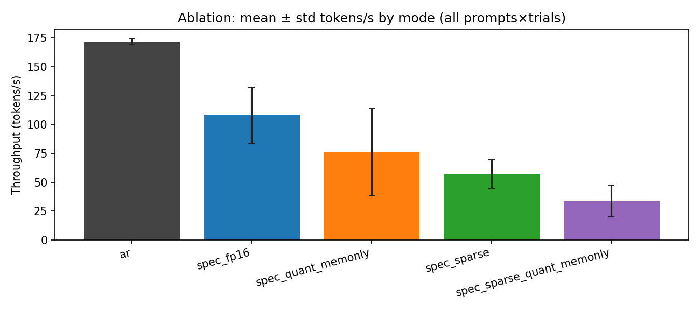

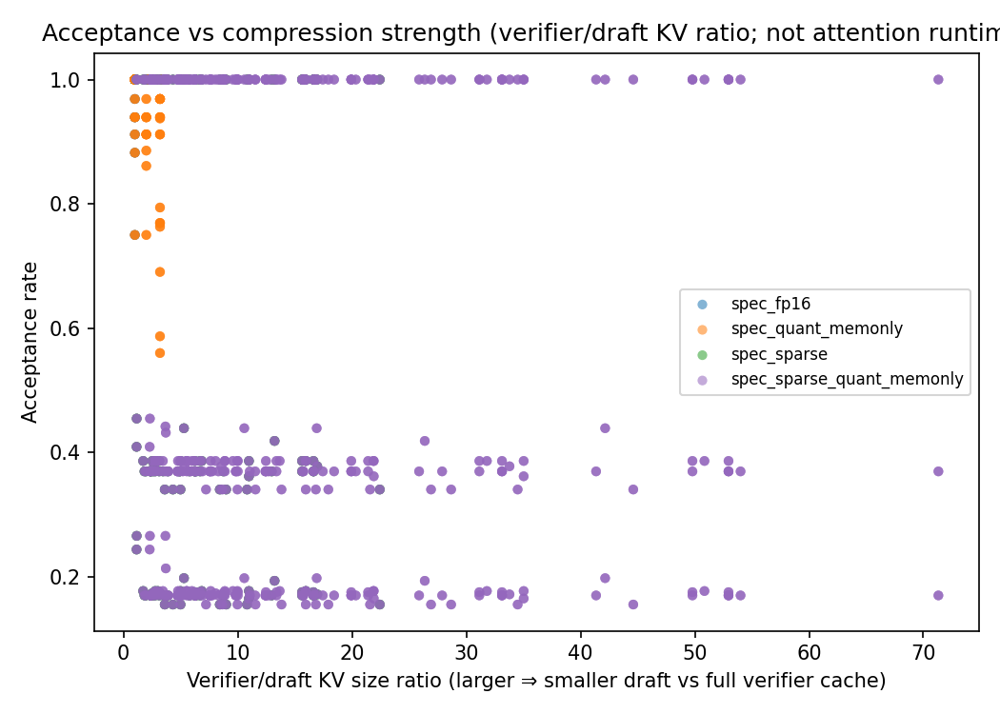

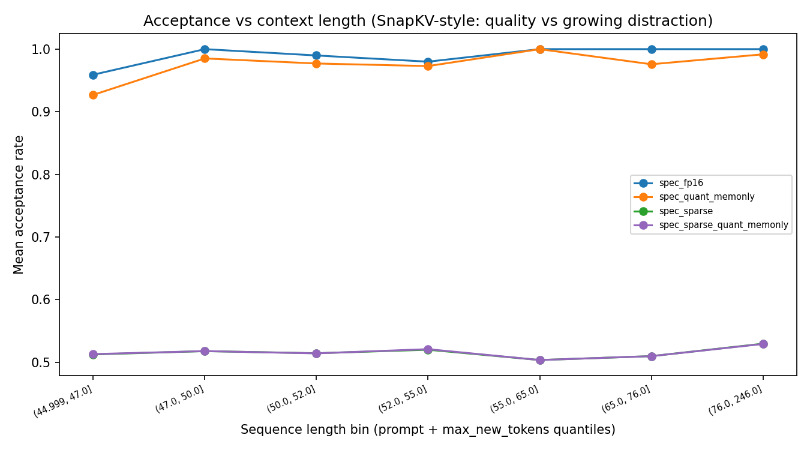

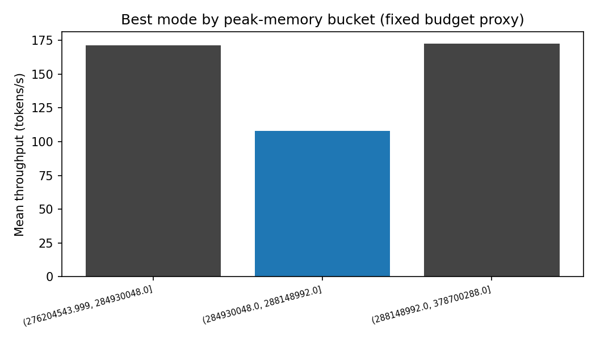

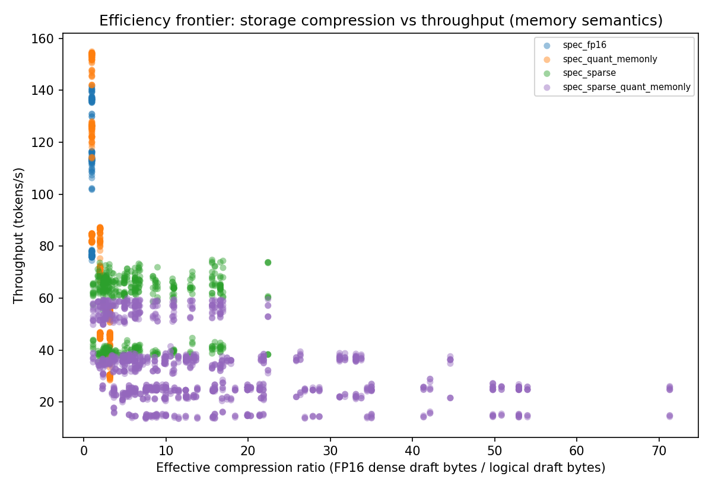

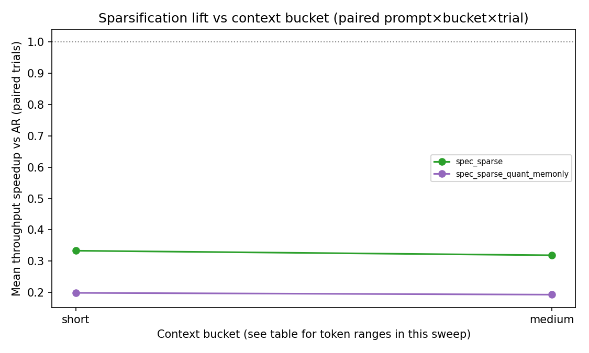

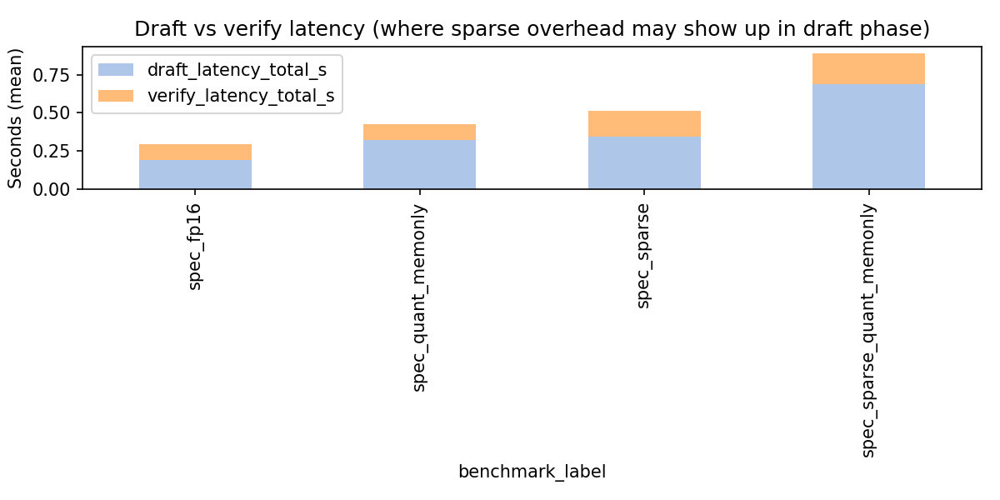

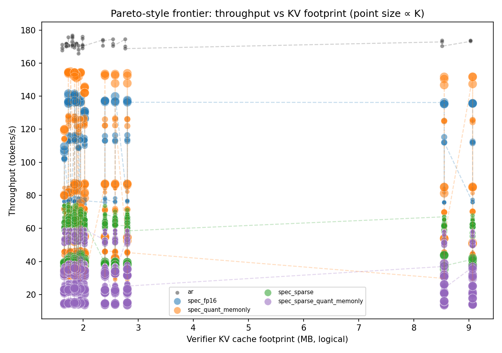

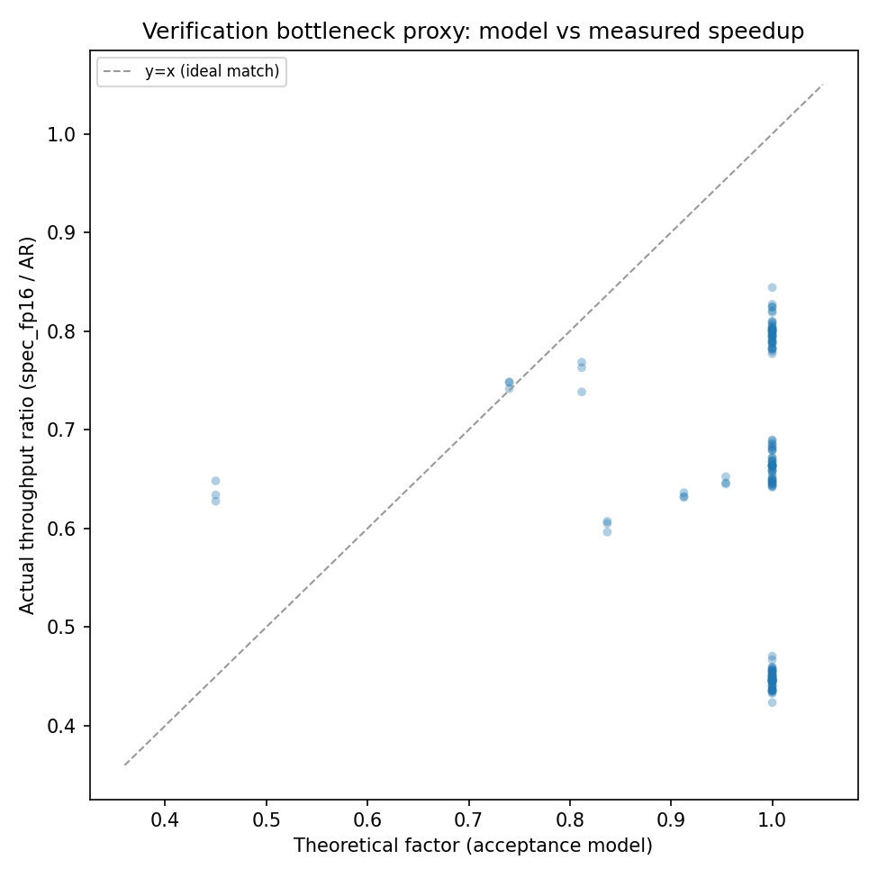

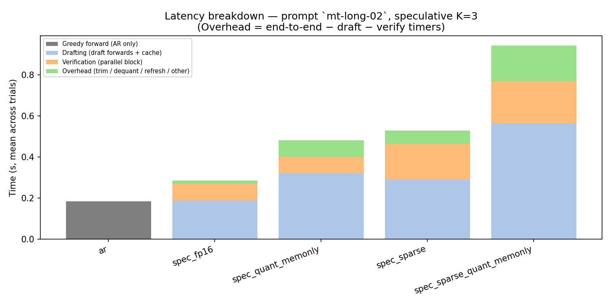

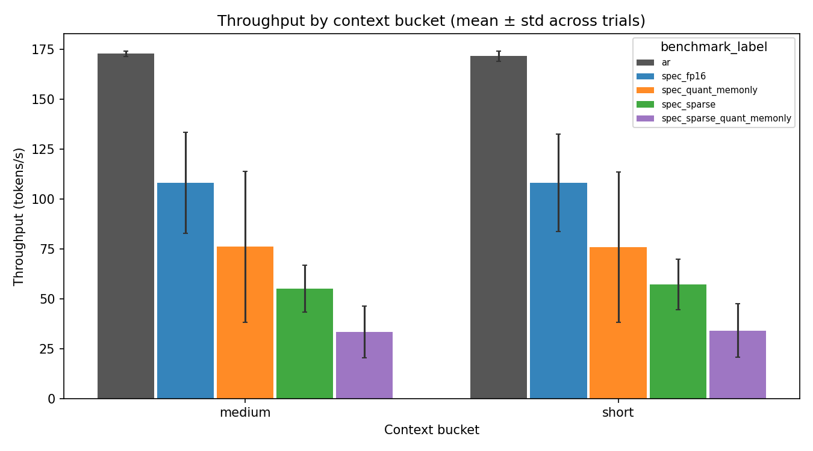

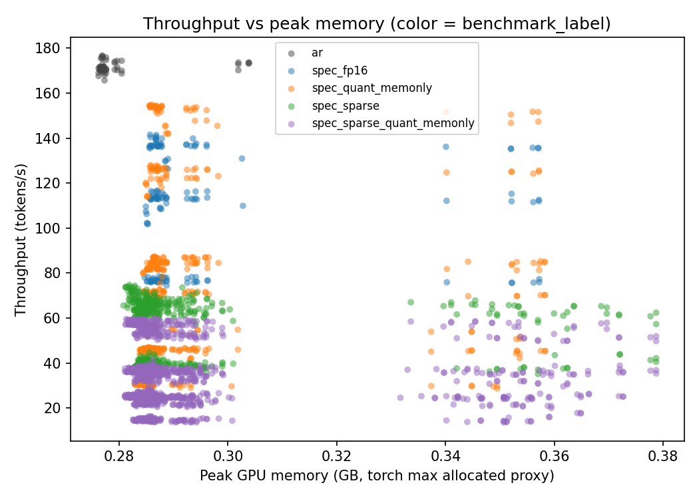

### Figure guide

| File | What it shows |
|------|----------------|
| `figures/pareto_throughput_vs_kv_mb.png` | **Paper core:** throughput vs **verifier KV (MB)**; color=mode; point size ∝ K; dashed lines connect sweep points per mode. |
| `figures/stacked_latency_single_prompt.png` | **Where time goes:** AR vs draft / verify / residual overhead for one long prompt. |
| `figures/acceptance_vs_sequence_length.png` | Acceptance vs binned **prompt+gen** length. |
| `figures/acceptance_vs_compression.png` | Acceptance vs **compression strength** (verifier/draft KV ratio). |
| `figures/throughput_by_context_bucket.png` | Throughput by **short/medium/long** with **±std** across trials. |
| `figures/best_throughput_under_memory_budget.png` | Best mode per **peak-VRAM tertile** (fixed budget proxy). |
| `figures/ablation_modes.png` | Global ablation with **error bars** (trial std). |
| `figures/throughput_vs_memory.png` | Tokens/s vs **peak torch memory** (hardware footprint). |
| `figures/compression_frontier_throughput.png` | **Compression frontier:** dense FP16 draft baseline / stored draft bytes vs throughput. |
| `figures/spec_fp16_theoretical_vs_actual_speedup.png` | **Verification model:** acceptance-based factor vs measured spec_fp16/AR ratio. |
| `figures/context_bucket_sparsification_lift.png` | Sparse modes: mean speedup vs AR by **context bucket**. |

## Interpretation (quantization + sparsity)

- **Joint effect (sparse + quant):** If `sparse_quant` acceptance is **materially lower** than `sparse_only` at the same (prompt, bucket, K, sparsity, trial), low-bit **memory-only** packing may be disturbing draft–verifier agreement — see `tables/joint_sparse_quant_vs_sparse_only.csv`.

- **Effective compression:** `effective_compression_ratio` = FP16 **dense draft** bytes (from `spec_fp16` at the same cell) divided by **logical** draft bytes. This maps **storage** compression to throughput; it does **not** claim faster attention unless `quantization_type` indicates runtime acceleration.

- **Verification bottleneck:** The scatter compares a simple **acceptance-based factor** to the measured **spec_fp16/AR** throughput ratio. Points **below** the y=x line suggest **system overhead** (draft/verify/sync, data movement) vs the idealized model.

- **Context buckets:** This sweep labels **short / medium / long** using YAML thresholds (see `tables/context_bucket_prompt_token_ranges.csv` for empirical token ranges in **this** CSV). Compare to fixed 512/1024 token cuts only if you re-bucket in post-processing.

## Separation of effects (honest)

- **Sparse-driven runtime:** draft latency fraction, acceptance vs length, sparse rows in tables.
- **Quantization-driven memory:** lower `logical_draft_kv_bytes` for Memory-Only INT KV; speed may not follow (dequant overhead).
- **True runtime gains:** only claim if `quantization_type` / metrics JSON indicate accelerated kernels (not default here).

## Failure-analysis summaries

### Acceptance loss

- **spec_sparse_quant_memonly** vs FP16 at prompt `mt-014`, K=7, bucket=short: drop **0.840** (FP16 1.000 → 0.160)
- **spec_sparse** vs FP16 at prompt `mt-014`, K=7, bucket=short: drop **0.840** (FP16 1.000 → 0.160)
- **spec_sparse** vs FP16 at prompt `mt-013`, K=7, bucket=short: drop **0.837** (FP16 1.000 → 0.163)
- **spec_sparse_quant_memonly** vs FP16 at prompt `mt-013`, K=7, bucket=short: drop **0.837** (FP16 1.000 → 0.163)
- **spec_sparse_quant_memonly** vs FP16 at prompt `mt-006`, K=7, bucket=short: drop **0.830** (FP16 1.000 → 0.170)


### Sparse overhead

**Interpretation:** high draft fraction suggests **selector/refresh** cost dominates that regime.

- K=7.0, sparsity_budget=1.0: draft share of draft+verify = **0.77** (mean over prompts)
- K=7.0, sparsity_budget=0.4: draft share of draft+verify = **0.77** (mean over prompts)
- K=7.0, sparsity_budget=0.1: draft share of draft+verify = **0.77** (mean over prompts)


### Quantization overhead (memory-only vs FP16 spec)

- Mean **latency ratio** (memory-only quant / FP16 spec), aligned runs: **1.712**.
- Values **> 1** are expected when dequant + standard attention dominates; this is **not** a contradiction of memory-only KV benefits on **bytes moved**.


### Joint method tradeoffs

- Joint mode combines **sparse retention** (runtime: scoring/refresh) with **memory-only INT KV**.
- Attribute **speed** changes primarily to **sparsity**; attribute **KV bytes** to **both**.


## Detailed tables

### Mean acceptance by mode and K

| benchmark_label | spec_k | mean | std | count |
| --- | --- | --- | --- | --- |
| spec_fp16 | 1 | 1.0 | 0.0 | 51 |
| spec_fp16 | 3 | 0.9876762870923771 | 0.030895272681992096 | 51 |
| spec_fp16 | 7 | 0.9765387438397819 | 0.062258128394492476 | 51 |
| spec_quant_memonly | 1 | 1.0 | 0.0 | 153 |
| spec_quant_memonly | 3 | 0.9810485914508406 | 0.03780459143268301 | 153 |
| spec_quant_memonly | 7 | 0.9359482297436698 | 0.1108937293149612 | 153 |
| spec_sparse | 1 | 1.0 | 0.0 | 153 |
| spec_sparse | 3 | 0.3751096611912421 | 0.022006323437707646 | 153 |
| spec_sparse | 7 | 0.17395169508774241 | 0.018445491775697175 | 153 |
| spec_sparse_quant_memonly | 1 | 1.0 | 0.0 | 459 |
| spec_sparse_quant_memonly | 3 | 0.37566512514819517 | 0.02216546365314143 | 459 |
| spec_sparse_quant_memonly | 7 | 0.1739578663744921 | 0.017775631382796767 | 459 |


### Acceptance drops vs `spec_fp16`

| prompt_id | spec_k | context_bucket | reference_label | ref_acceptance | compare_label | compare_acceptance | acceptance_drop |
| --- | --- | --- | --- | --- | --- | --- | --- |
| mt-007 | 7 | short | spec_fp16 | 1.0 | spec_quant_memonly | 0.8916408668730651 | 0.1083591331269349 |
| mt-010 | 3 | short | spec_fp16 | 1.0 | spec_quant_memonly | 0.9313725490196079 | 0.06862745098039214 |
| mt-010 | 7 | short | spec_fp16 | 1.0 | spec_quant_memonly | 0.7789855072463768 | 0.22101449275362317 |
| mt-011 | 7 | short | spec_fp16 | 1.0 | spec_quant_memonly | 0.9230769230769231 | 0.07692307692307687 |
| mt-015 | 7 | short | spec_fp16 | 1.0 | spec_quant_memonly | 0.8968253968253967 | 0.10317460317460325 |
| mt-001 | 3 | short | spec_fp16 | 0.96875 | spec_sparse | 0.37254366047150506 | 0.5962063395284949 |
| mt-001 | 7 | short | spec_fp16 | 0.9393939393939394 | spec_sparse | 0.1707106256742179 | 0.7686833137197215 |
| mt-002 | 3 | short | spec_fp16 | 1.0 | spec_sparse | 0.3863636363636363 | 0.6136363636363638 |
| mt-002 | 7 | short | spec_fp16 | 1.0 | spec_sparse | 0.1752577319587628 | 0.8247422680412372 |
| mt-003 | 3 | short | spec_fp16 | 1.0 | spec_sparse | 0.36545146188994476 | 0.6345485381100553 |
| mt-003 | 7 | short | spec_fp16 | 0.9117647058823528 | spec_sparse | 0.16747437971952533 | 0.7442903261628275 |
| mt-004 | 3 | short | spec_fp16 | 0.9393939393939394 | spec_sparse | 0.3695652173913043 | 0.5698287220026351 |
| mt-004 | 7 | short | spec_fp16 | 1.0 | spec_sparse | 0.17 | 0.83 |
| mt-005 | 3 | short | spec_fp16 | 1.0 | spec_sparse | 0.41466422592344315 | 0.5853357740765568 |
| mt-005 | 7 | short | spec_fp16 | 1.0 | spec_sparse | 0.18827332421802467 | 0.8117266757819753 |
| mt-006 | 3 | short | spec_fp16 | 1.0 | spec_sparse | 0.3695652173913043 | 0.6304347826086957 |
| mt-006 | 7 | short | spec_fp16 | 1.0 | spec_sparse | 0.17 | 0.83 |
| mt-007 | 3 | short | spec_fp16 | 1.0 | spec_sparse | 0.3863636363636363 | 0.6136363636363638 |
| mt-007 | 7 | short | spec_fp16 | 1.0 | spec_sparse | 0.1770833333333333 | 0.8229166666666667 |
| mt-008 | 3 | short | spec_fp16 | 1.0 | spec_sparse | 0.3863636363636363 | 0.6136363636363638 |
| mt-008 | 7 | short | spec_fp16 | 1.0 | spec_sparse | 0.1752577319587628 | 0.8247422680412372 |
| mt-009 | 3 | short | spec_fp16 | 0.8823529411764706 | spec_sparse | 0.3501387604070305 | 0.53221418076944 |
| mt-009 | 7 | short | spec_fp16 | 0.75 | spec_sparse | 0.16022653721682847 | 0.5897734627831716 |
| mt-010 | 3 | short | spec_fp16 | 1.0 | spec_sparse | 0.3695652173913043 | 0.6304347826086957 |
| mt-010 | 7 | short | spec_fp16 | 1.0 | spec_sparse | 0.17 | 0.83 |
| mt-011 | 3 | short | spec_fp16 | 1.0 | spec_sparse | 0.37504025764895327 | 0.6249597423510467 |
| mt-011 | 7 | short | spec_fp16 | 1.0 | spec_sparse | 0.17114478114478116 | 0.8288552188552188 |
| mt-012 | 3 | short | spec_fp16 | 1.0 | spec_sparse | 0.37516469038208167 | 0.6248353096179183 |
| mt-012 | 7 | short | spec_fp16 | 1.0 | spec_sparse | 0.1723611111111111 | 0.8276388888888889 |
| mt-013 | 3 | short | spec_fp16 | 1.0 | spec_sparse | 0.35573823339780786 | 0.6442617666021921 |
| mt-013 | 7 | short | spec_fp16 | 1.0 | spec_sparse | 0.16258764832793957 | 0.8374123516720604 |
| mt-014 | 3 | short | spec_fp16 | 1.0 | spec_sparse | 0.3501387604070305 | 0.6498612395929695 |
| mt-014 | 7 | short | spec_fp16 | 1.0 | spec_sparse | 0.16022653721682847 | 0.8397734627831716 |
| mt-015 | 3 | short | spec_fp16 | 1.0 | spec_sparse | 0.3695652173913043 | 0.6304347826086957 |
| mt-015 | 7 | short | spec_fp16 | 1.0 | spec_sparse | 0.17 | 0.83 |
| mt-long-01 | 3 | medium | spec_fp16 | 1.0 | spec_sparse | 0.3978919631093544 | 0.6021080368906456 |
| mt-long-01 | 7 | medium | spec_fp16 | 1.0 | spec_sparse | 0.20194092827004217 | 0.7980590717299578 |
| mt-long-02 | 3 | medium | spec_fp16 | 1.0 | spec_sparse | 0.38274044795783924 | 0.6172595520421608 |
| mt-long-02 | 7 | medium | spec_fp16 | 1.0 | spec_sparse | 0.19463414634146342 | 0.8053658536585366 |
| mt-001 | 3 | short | spec_fp16 | 0.96875 | spec_sparse_quant_memonly | 0.3762766424653566 | 0.5924733575346435 |
| mt-001 | 7 | short | spec_fp16 | 0.9393939393939394 | spec_sparse_quant_memonly | 0.17228469974829197 | 0.7671092396456475 |
| mt-002 | 3 | short | spec_fp16 | 1.0 | spec_sparse_quant_memonly | 0.3863636363636363 | 0.6136363636363638 |
| mt-002 | 7 | short | spec_fp16 | 1.0 | spec_sparse_quant_memonly | 0.1752577319587628 | 0.8247422680412372 |
| mt-003 | 3 | short | spec_fp16 | 1.0 | spec_sparse_quant_memonly | 0.36545146188994476 | 0.6345485381100553 |
| mt-003 | 7 | short | spec_fp16 | 0.9117647058823528 | spec_sparse_quant_memonly | 0.16747437971952533 | 0.7442903261628275 |
| mt-004 | 3 | short | spec_fp16 | 0.9393939393939394 | spec_sparse_quant_memonly | 0.3695652173913043 | 0.5698287220026351 |
| mt-004 | 7 | short | spec_fp16 | 1.0 | spec_sparse_quant_memonly | 0.17000000000000004 | 0.83 |
| mt-005 | 3 | short | spec_fp16 | 1.0 | spec_sparse_quant_memonly | 0.4169330858213445 | 0.5830669141786555 |
| mt-005 | 7 | short | spec_fp16 | 1.0 | spec_sparse_quant_memonly | 0.18874596985196063 | 0.8112540301480393 |
| mt-006 | 3 | short | spec_fp16 | 1.0 | spec_sparse_quant_memonly | 0.3695652173913043 | 0.6304347826086957 |
| mt-006 | 7 | short | spec_fp16 | 1.0 | spec_sparse_quant_memonly | 0.17000000000000004 | 0.83 |
| mt-007 | 3 | short | spec_fp16 | 1.0 | spec_sparse_quant_memonly | 0.3863636363636363 | 0.6136363636363638 |
| mt-007 | 7 | short | spec_fp16 | 1.0 | spec_sparse_quant_memonly | 0.1770833333333333 | 0.8229166666666667 |
| mt-008 | 3 | short | spec_fp16 | 1.0 | spec_sparse_quant_memonly | 0.3863636363636363 | 0.6136363636363638 |
| mt-008 | 7 | short | spec_fp16 | 1.0 | spec_sparse_quant_memonly | 0.1752577319587628 | 0.8247422680412372 |
| mt-009 | 3 | short | spec_fp16 | 0.8823529411764706 | spec_sparse_quant_memonly | 0.35337650323774283 | 0.5289764379387277 |
| mt-009 | 7 | short | spec_fp16 | 0.75 | spec_sparse_quant_memonly | 0.1618554476806904 | 0.5881445523193096 |
| mt-010 | 3 | short | spec_fp16 | 1.0 | spec_sparse_quant_memonly | 0.3695652173913043 | 0.6304347826086957 |
| mt-010 | 7 | short | spec_fp16 | 1.0 | spec_sparse_quant_memonly | 0.17000000000000004 | 0.83 |
| mt-011 | 3 | short | spec_fp16 | 1.0 | spec_sparse_quant_memonly | 0.37412775093934514 | 0.6258722490606549 |
| mt-011 | 7 | short | spec_fp16 | 1.0 | spec_sparse_quant_memonly | 0.17095398428731765 | 0.8290460157126823 |
| mt-012 | 3 | short | spec_fp16 | 1.0 | spec_sparse_quant_memonly | 0.37516469038208167 | 0.6248353096179183 |
| mt-012 | 7 | short | spec_fp16 | 1.0 | spec_sparse_quant_memonly | 0.1723611111111111 | 0.8276388888888889 |
| mt-013 | 3 | short | spec_fp16 | 1.0 | spec_sparse_quant_memonly | 0.35573823339780786 | 0.6442617666021921 |
| mt-013 | 7 | short | spec_fp16 | 1.0 | spec_sparse_quant_memonly | 0.16258764832793957 | 0.8374123516720604 |
| mt-014 | 3 | short | spec_fp16 | 1.0 | spec_sparse_quant_memonly | 0.3501387604070305 | 0.6498612395929695 |
| mt-014 | 7 | short | spec_fp16 | 1.0 | spec_sparse_quant_memonly | 0.16022653721682847 | 0.8397734627831716 |
| mt-015 | 3 | short | spec_fp16 | 1.0 | spec_sparse_quant_memonly | 0.3695652173913043 | 0.6304347826086957 |
| mt-015 | 7 | short | spec_fp16 | 1.0 | spec_sparse_quant_memonly | 0.17000000000000004 | 0.83 |
| mt-long-01 | 3 | medium | spec_fp16 | 1.0 | spec_sparse_quant_memonly | 0.39536671058410183 | 0.6046332894158981 |
| mt-long-01 | 7 | medium | spec_fp16 | 1.0 | spec_sparse_quant_memonly | 0.19612541285418542 | 0.8038745871458146 |
| mt-long-02 | 3 | medium | spec_fp16 | 1.0 | spec_sparse_quant_memonly | 0.38638150973843594 | 0.613618490261564 |
| mt-long-02 | 7 | medium | spec_fp16 | 1.0 | spec_sparse_quant_memonly | 0.19706974031765634 | 0.8029302596823437 |


### Sparse draft-latency share

| spec_k | sparsity_budget | draft_latency_fraction | compression_ratio_verifier_over_draft | acceptance_rate | n |
| --- | --- | --- | --- | --- | --- |
| 1.0 | 0.1 | 0.5199636534000924 | 13.089558157472363 | 1.0 | 51.0 |
| 1.0 | 0.4 | 0.5232153365885404 | 5.410379924875311 | 1.0 | 51.0 |
| 1.0 | 1.0 | 0.523097959335857 | 2.439920564900485 | 1.0 | 51.0 |
| 3.0 | 0.1 | 0.6011154872530632 | 13.089558157472363 | 0.3712807187963823 | 51.0 |
| 3.0 | 0.4 | 0.6031787600293336 | 5.410379924875311 | 0.37074722367579155 | 51.0 |
| 3.0 | 1.0 | 0.6088510559439867 | 2.439920564900485 | 0.38330104110155255 | 51.0 |
| 7.0 | 0.1 | 0.7668422779023804 | 13.089558157472363 | 0.17005974415077568 | 51.0 |
| 7.0 | 0.4 | 0.76838833508217 | 5.410379924875311 | 0.16963785598160946 | 51.0 |
| 7.0 | 1.0 | 0.7730174369164781 | 2.439920564900485 | 0.18215748513084212 | 51.0 |


### FP16 vs memory-only quant (pivot)

| prompt_id | spec_k | context_bucket | latency_per_new_token_s_spec_fp16 | latency_per_new_token_s_spec_quant_memonly | logical_draft_kv_bytes_spec_fp16 | logical_draft_kv_bytes_spec_quant_memonly | memory_throughput_gb_s_spec_fp16 | memory_throughput_gb_s_spec_quant_memonly | tokens_per_sec_spec_fp16 | tokens_per_sec_spec_quant_memonly |
| --- | --- | --- | --- | --- | --- | --- | --- | --- | --- | --- |
| mt-001 | 1 | short | 0.013089364541666334 | 0.022318298361104355 | 2027520.0 | 1224992.0 | 19.175979589095146 | 13.440450112116107 | 76.42660107162176 | 53.56742867654473 |
| mt-001 | 3 | short | 0.008966400468749967 | 0.014743805451404166 | 2027520.0 | 1224992.0 | 27.988561221894656 | 20.05282133403838 | 111.5494826814916 | 79.92128742818372 |
| mt-001 | 7 | short | 0.007678750124998833 | 0.01217251281944219 | 2027520.0 | 1224992.0 | 32.67603708227305 | 24.045170278828845 | 130.23159724828653 | 95.83294705029373 |
| mt-002 | 1 | short | 0.0129258960625001 | 0.022417778968746055 | 1843200.0 | 1113632.0 | 19.399587058142547 | 13.217424281759971 | 77.3746377279942 | 52.71727756025192 |
| mt-002 | 3 | short | 0.008775329020834199 | 0.014547057020839256 | 1843200.0 | 1113632.0 | 28.5713711022015 | 20.419148954559553 | 113.9560075067181 | 81.44112801668417 |
| mt-002 | 7 | short | 0.007210246802083933 | 0.012081437836804433 | 1843200.0 | 1113632.0 | 34.7781870525376 | 24.612430086621554 | 138.7116960769043 | 98.16589682297422 |
| mt-003 | 1 | short | 0.0129243586041667 | 0.022435507774307258 | 2027520.0 | 1224992.0 | 19.41552530172687 | 13.405327668995131 | 77.38131968365728 | 53.42744683433448 |
| mt-003 | 3 | short | 0.008787983145833 | 0.014522269340286787 | 2027520.0 | 1224992.0 | 28.552234103793115 | 20.341565331729583 | 113.79602254035979 | 81.0720876895649 |
| mt-003 | 7 | short | 0.007817035156250466 | 0.013911900586808489 | 2027520.0 | 1224992.0 | 32.10534909288695 | 22.36620199531051 | 127.95709840985529 | 89.14135465366164 |
| mt-004 | 1 | short | 0.012899531760416366 | 0.02232006317360751 | 1916928.0 | 1158176.0 | 19.444331255467986 | 13.379311760043157 | 77.53029984124497 | 53.347273238514624 |
| mt-004 | 3 | short | 0.009195448739583001 | 0.015006395690982567 | 1916928.0 | 1158176.0 | 27.274174751890417 | 19.566124176333428 | 108.75020172483086 | 78.01592423990272 |
| mt-004 | 7 | short | 0.007288375697915667 | 0.0119986707152861 | 1916928.0 | 1158176.0 | 34.41064153727944 | 24.67794627579999 | 137.20540557879232 | 98.39827089403587 |
| mt-005 | 1 | short | 0.0130209175520832 | 0.022660235878472778 | 1953792.0 | 1180448.0 | 19.266168715381145 | 13.27231561946765 | 76.80862317742438 | 52.91287043976076 |
| mt-005 | 3 | short | 0.0087549806979166 | 0.014599944083341912 | 1953792.0 | 1180448.0 | 28.652966994201908 | 20.147580323335944 | 114.23106364763784 | 80.32255545216668 |
| mt-005 | 7 | short | 0.007273446958331867 | 0.012759513805564044 | 1953792.0 | 1180448.0 | 34.491310880469776 | 23.63188078039593 | 137.5068462988382 | 94.2134501493355 |
| mt-006 | 1 | short | 0.013093982552083367 | 0.02225051896179917 | 1843200.0 | 1113632.0 | 19.148013953925474 | 13.343967378887974 | 76.3712463804071 | 53.22199068986196 |
| mt-006 | 3 | short | 0.008836111718749701 | 0.014630726548602944 | 1843200.0 | 1113632.0 | 28.374947092086757 | 20.30395999136695 | 113.17257657191739 | 80.98170049018174 |
| mt-006 | 7 | short | 0.007229640854166701 | 0.012070500180559223 | 1843200.0 | 1113632.0 | 34.683571223452724 | 24.71232702863385 | 138.33432384331834 | 98.56433260798192 |
| mt-007 | 1 | short | 0.012956378822916633 | 0.02203282224304021 | 1769472.0 | 1069088.0 | 19.346439365068605 | 13.508456391800122 | 77.18535710398676 | 53.89389803724369 |
| mt-007 | 3 | short | 0.0087438731666663 | 0.014928764159732369 | 1769472.0 | 1069088.0 | 28.66884068768408 | 20.03487926006816 | 114.37839617307556 | 79.93198546993379 |
| mt-007 | 7 | short | 0.007324137395833867 | 0.013563838670134101 | 1769472.0 | 1069088.0 | 34.2223985330234 | 23.543688040675775 | 136.53510094967268 | 93.93087454870681 |
| mt-008 | 1 | short | 0.0131243310208336 | 0.02223461320138789 | 1732608.0 | 1046816.0 | 19.095507514022586 | 13.351370989717376 | 76.19543535922088 | 53.27501897799437 |
| mt-008 | 3 | short | 0.008753405406250034 | 0.014617988434022412 | 1732608.0 | 1046816.0 | 28.63544671690438 | 20.177514658331738 | 114.2619711834343 | 80.51289093676348 |
| mt-008 | 7 | short | 0.007275529395832534 | 0.012306560055542811 | 1732608.0 | 1046816.0 | 34.454137097576165 | 24.292174849366347 | 137.47987447562082 | 96.93132466422048 |
| mt-009 | 1 | short | 0.012997429906250168 | 0.022149299447916146 | 1658880.0 | 1002272.0 | 19.278723198188676 | 13.321135433264791 | 76.94914556439534 | 53.17001437282034 |
| mt-009 | 3 | short | 0.009801469562500333 | 0.014943623607640157 | 1658880.0 | 1002272.0 | 25.56143216791268 | 19.29797469831661 | 102.02596637249981 | 77.0259860517268 |
| mt-009 | 7 | short | 0.0092832448854179 | 0.01669225567014281 | 1658880.0 | 1002272.0 | 26.9926928931352 | 19.54150561089655 | 107.73870412766907 | 77.99801596516548 |
| mt-010 | 1 | short | 0.013072682166666698 | 0.022100756565969732 | 1732608.0 | 1046816.0 | 19.170849713296146 | 13.405112652193317 | 76.49606793839452 | 53.4894604829544 |
| mt-010 | 3 | short | 0.008840996218750568 | 0.015346477774313678 | 1732608.0 | 1046816.0 | 28.346921110884775 | 20.02032808005122 | 113.11068813181582 | 79.88568059653477 |
| mt-010 | 7 | short | 0.0072456922916674 | 0.01591412015624701 | 1732608.0 | 1046816.0 | 34.59890213513557 | 21.75337652735138 | 138.05752003196608 | 86.80093963553583 |
| mt-011 | 1 | short | 0.0131111493854163 | 0.022224630718754777 | 1880064.0 | 1135904.0 | 19.12577989995516 | 13.297477471263804 | 76.27135231611062 | 53.02877030016869 |
| mt-011 | 3 | short | 0.008683504531249468 | 0.014640835715270932 | 1880064.0 | 1135904.0 | 28.883812142320195 | 20.19524718411471 | 115.18523289836786 | 80.53626158764723 |
| mt-011 | 7 | short | 0.007313775343751133 | 0.013546639628461579 | 1880064.0 | 1135904.0 | 34.28620765238412 | 23.617003509959492 | 136.72934840395445 | 94.18182185413337 |
| mt-012 | 1 | short | 0.013094003083333266 | 0.0222915601423652 | 1843200.0 | 1113632.0 | 19.14815926022109 | 13.289975497104397 | 76.37182592995879 | 53.00664578170818 |
| mt-012 | 3 | short | 0.0087348214479169 | 0.014613368597224455 | 1843200.0 | 1113632.0 | 28.707873780773024 | 20.267743037434283 | 114.50044411104979 | 80.83725031803361 |
| mt-012 | 7 | short | 0.0071566111666664335 | 0.012492099326386223 | 1843200.0 | 1113632.0 | 35.039736956847015 | 24.29620442465453 | 139.7548795752478 | 96.90464079924233 |
| mt-013 | 1 | short | 0.0130747335729169 | 0.022457365354177344 | 2801664.0 | 1692704.0 | 19.249744751551532 | 13.356818862254924 | 76.48461082028639 | 53.0703708366984 |
| mt-013 | 3 | short | 0.008753913354166665 | 0.014648268805552098 | 2801664.0 | 1692704.0 | 28.755948873801028 | 20.28271904672412 | 114.25541412456668 | 80.58890612255358 |
| mt-013 | 7 | short | 0.007298570385415766 | 0.012228087656252534 | 2801664.0 | 1692704.0 | 34.484175764430624 | 24.49869258598381 | 137.01525899912232 | 97.34014618005682 |
| mt-014 | 1 | short | 0.0129501329791666 | 0.02214279015624414 | 2396160.0 | 1447712.0 | 19.40724396828782 | 13.421767571838402 | 77.23483846006637 | 53.414490586782236 |
| mt-014 | 3 | short | 0.008772480500000466 | 0.014617489645830631 | 2396160.0 | 1447712.0 | 28.647548461238546 | 20.171604028064408 | 114.00839713748827 | 80.2767554802593 |
| mt-014 | 7 | short | 0.007303396520833567 | 0.012094642100685645 | 2396160.0 | 1447712.0 | 34.40548708579657 | 24.668508925815658 | 136.92321493734664 | 98.1730484271419 |
| mt-015 | 1 | short | 0.0130229036354177 | 0.022286143850698766 | 2580480.0 | 1559072.0 | 19.312447926483763 | 13.464452680852325 | 76.80124295539822 | 53.54508685486354 |
| mt-015 | 3 | short | 0.0087687611979152 | 0.014665198836818598 | 2580480.0 | 1559072.0 | 28.68239216015419 | 20.252339173562618 | 114.06339461571743 | 80.53897813497461 |
| mt-015 | 7 | short | 0.007262577708332866 | 0.014004157114584335 | 2580480.0 | 1559072.0 | 34.62839587971068 | 23.469005886075184 | 137.7093082781241 | 93.33093504456144 |
| mt-long-01 | 1 | medium | 0.013197749583333898 | 0.022539377142373265 | 8552448.0 | 5167136.0 | 19.505802957308045 | 13.585905032508304 | 75.77068160906344 | 52.774719750948755 |
| mt-long-01 | 3 | medium | 0.008841505552081666 | 0.014782299104170822 | 8552448.0 | 5167136.0 | 29.121540796592672 | 20.6090533942235 | 113.12320751385762 | 80.05627999091637 |
| mt-long-01 | 7 | medium | 0.0073748346979165 | 0.012388450111125623 | 8552448.0 | 5167136.0 | 34.90715259559152 | 24.65676189900769 | 135.5975322312279 | 95.77968461227769 |
| mt-long-02 | 1 | medium | 0.0130977211249998 | 0.0227002161909821 | 9068544.0 | 5478944.0 | 19.695666275988597 | 13.590078665309056 | 76.35513382219357 | 52.68530958045623 |
| mt-long-02 | 3 | medium | 0.008924853562501 | 0.015065412260431232 | 9068544.0 | 5478944.0 | 28.90262609972379 | 20.530742200629227 | 112.0481964272348 | 79.59251269956422 |
| mt-long-02 | 7 | medium | 0.007372385468749767 | 0.012678217434035457 | 9068544.0 | 5478944.0 | 34.9884406263817 | 24.61453275839204 | 135.64136540606341 | 95.42433936490201 |


### Best throughput under memory tertiles

| mem_bucket | best_benchmark_label | mean_tokens_per_sec | runner_up_label | runner_up_tps |
| --- | --- | --- | --- | --- |
| (276204543.999, 284930048.0] | ar | 171.5506946599878 | spec_fp16 | 98.3364678238699 |
| (284930048.0, 288148992.0] | spec_fp16 | 107.96119784464882 | spec_quant_memonly | 82.50611490968802 |
| (288148992.0, 378700288.0] | ar | 172.82438540049498 | spec_fp16 | 108.59786548686758 |


### Joint vs components

| benchmark_label | mean_tokens_per_sec | mean_draft_kv_bytes | mean_acceptance | n |
| --- | --- | --- | --- | --- |
| spec_quant_memonly | 75.82741699964168 | 1692704.0 | 0.9723322737315033 | 459 |
| spec_sparse | 56.91504264225545 | 914175.2156862745 | 0.5163537854263283 | 459 |
| spec_sparse_quant_memonly | 33.994938872289296 | 552554.5098039216 | 0.5165409971742291 | 1377 |


### Joint sparse×quant vs sparse-only (acceptance)

| quant_bits_effective | n_paired_rows | mean_acceptance_sparse_only | mean_acceptance_sparse_quant | mean_delta_sparse_only_minus_joint | std_delta | p_value_delta_eq_0 | notes |
| --- | --- | --- | --- | --- | --- | --- | --- |
| 4 | 459 | 0.5163537854263283 | 0.5167593307856801 | -0.0004055453593519363 | 0.006618259351282007 | nan | H0: delta=0; paired cells (prompt×bucket×K×sparsity×trial) |
| 8 | 459 | 0.5163537854263283 | 0.5165098753106789 | -0.00015608988435075326 | 0.0014671797898544647 | nan | H0: delta=0; paired cells (prompt×bucket×K×sparsity×trial) |
| 16 | 459 | 0.5163537854263283 | 0.5163537854263283 | 0.0 | 0.0 | nan | H0: delta=0; paired cells (prompt×bucket×K×sparsity×trial) |


### Effective compression ratio (rows + by-mode means)

| benchmark_label | mean_effective_compression | std_effective_compression | mean_tokens_per_sec | n |
| --- | --- | --- | --- | --- |
| spec_fp16 | 1.0 | 0.0 | 108.03047368618626 | 153 |
| spec_quant_memonly | 2.066607260186188 | 0.9003682402672479 | 75.82741699964168 | 459 |
| spec_sparse | 6.979952882416053 | 5.3011109298813315 | 56.91504264225545 | 459 |
| spec_sparse_quant_memonly | 14.387545253392549 | 13.422335916627448 | 33.994938872289296 | 1377 |


*Full row-level table:* `tables/effective_compression_ratio_rows.csv`.

### Verification bottleneck (spec_fp16 vs AR)

| spec_k | n | mean_actual_ratio | mean_theoretical | mean_overhead_ratio | median_overhead_ratio |
| --- | --- | --- | --- | --- | --- |
| 1.0 | 51.0 | 0.4468431460804282 | 1.0 | 0.4468431460804282 | 0.44620981030902085 |
| 3.0 | 51.0 | 0.6566373220465317 | 0.9825744378115505 | 0.6689415044057161 | 0.664442201957484 |
| 7.0 | 51.0 | 0.7842285505464528 | 0.9412792771847943 | 0.8557371557608698 | 0.8009530826335365 |


*Per-row ratios:* `tables/verification_bottleneck_spec_fp16_rows.csv`.

### Context bucket: empirical prompt lengths + performance

| context_bucket | prompt_tokens_min | prompt_tokens_max | prompt_tokens_median | count |
| --- | --- | --- | --- | --- |
| medium | 200 | 214 | 207.0 | 294 |
| short | 13 | 44 | 19.0 | 2205 |


| benchmark_label | context_bucket | mean_tokens_per_sec | std_tokens_per_sec | mean_speedup_vs_ar | n_rows |
| --- | --- | --- | --- | --- | --- |
| spec_fp16 | medium | 108.08935283494013 | 25.245362225350963 | 0.6254502023660422 | 18 |
| spec_quant_memonly | medium | 76.05214099984421 | 37.87908689995577 | 0.44007604552566243 | 54 |
| spec_sparse | medium | 55.08837437991812 | 11.808890320744364 | 0.31877377230376397 | 54 |
| spec_sparse_quant_memonly | medium | 33.352493835457565 | 13.0239376789158 | 0.1929936245240335 | 162 |
| spec_fp16 | short | 108.02262313301907 | 24.41605650329562 | 0.6297411578500393 | 135 |
| spec_quant_memonly | short | 75.79745379961469 | 37.605899009099986 | 0.4418659937235527 | 405 |
| spec_sparse | short | 57.158598410567095 | 12.579559236998767 | 0.3332630412465758 | 405 |
| spec_sparse_quant_memonly | short | 34.08059821053352 | 13.514830243326928 | 0.1987071047835721 | 1215 |


---

Interpretation guide: `docs/PHASE16_ANALYSIS.md`.
