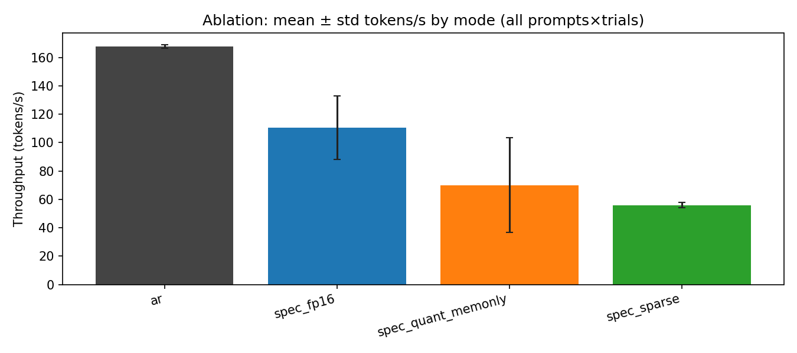
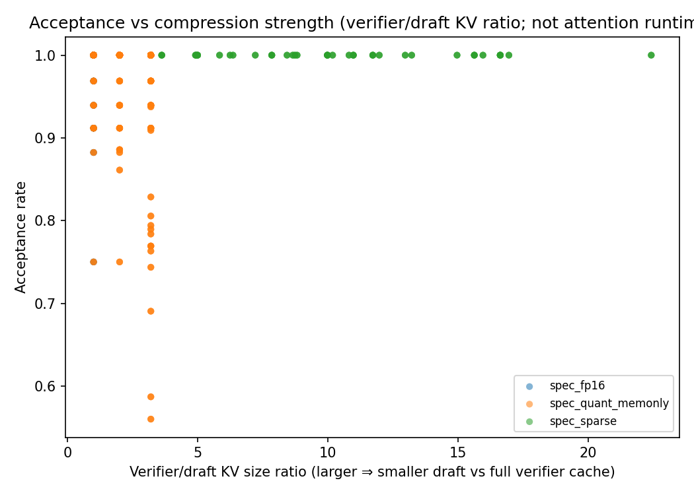
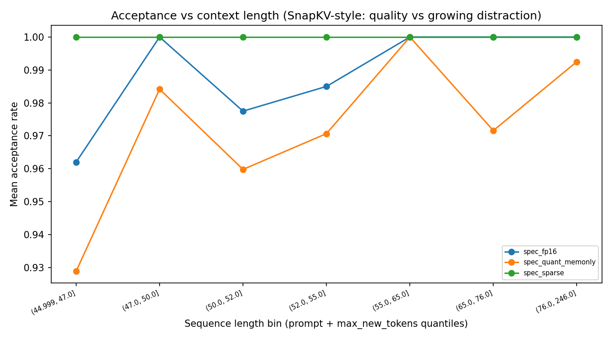
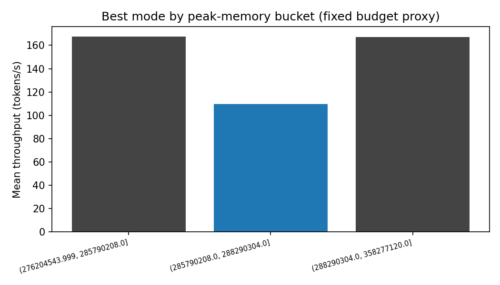
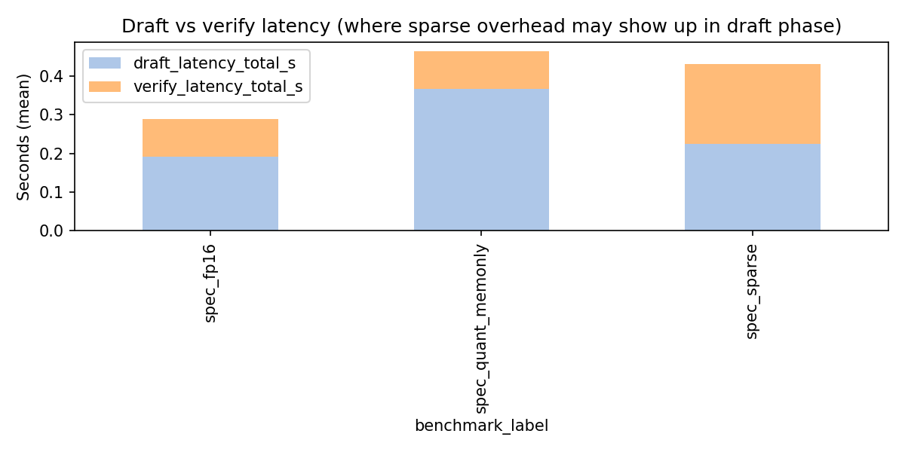
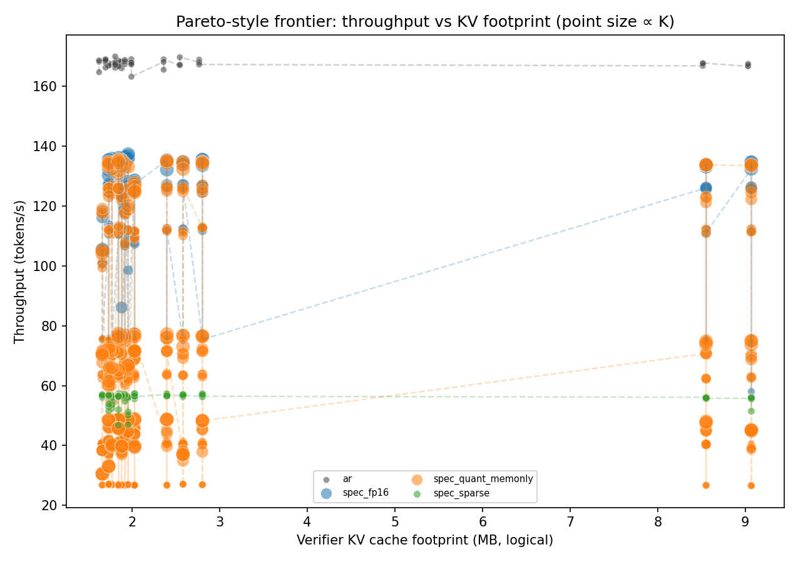
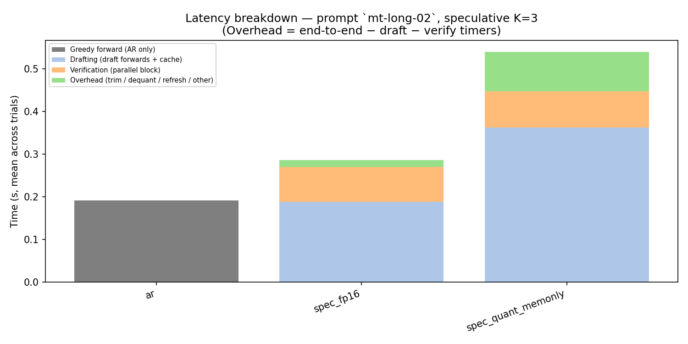
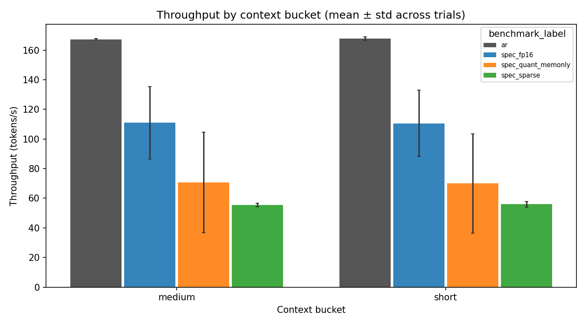
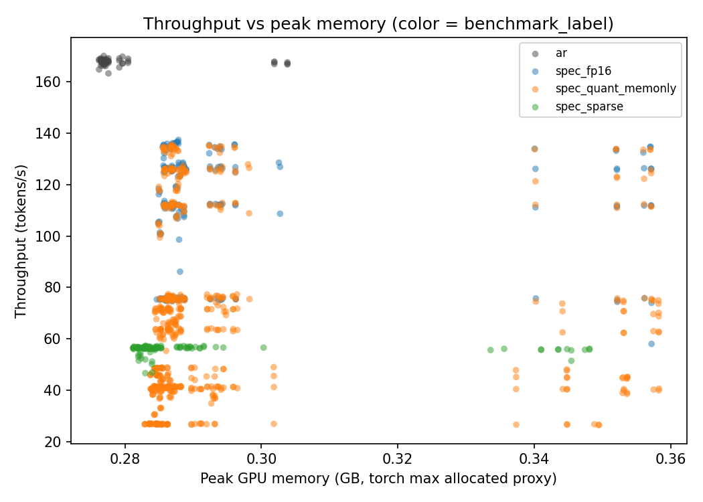

# Phase 16 benchmark analysis

**Source CSV:** `/Users/sohamk/Desktop/15442/15442-final-project/results/sweep_full_schema_v2.csv`  
**Rows (status=ok):** 978

See **`HOW_TO_VIEW.md`** in this folder for paths and viewing order.

## Quantization scope (read before interpreting plots)

Quantization in this sweep is **memory-only** (packed KV; attention still runs in higher precision after dequant). Do not claim INT KV alone reduced attention **runtime** unless paired with profiling that separates dequant vs matmul.

- **Counts by `quantization_type`:** {'none': 570, 'memory_only': 408}

- **Counts by `benchmark_label`:** {'spec_quant_memonly': 612, 'spec_fp16': 204, 'spec_sparse': 111, 'ar': 51}

### Honest labeling (tables + captions)

**Memory-only INT KV:** weights/KV are packed for footprint; attention consumes **dequantized** activations. Lack of speedup vs FP16 draft is consistent with **dequant + standard attention** overhead, not a failure of the memory story.

> **No `runtime_accelerated` quantization in CSV.** INT KV is **Memory-Only** in this prototype.

### Semantics check

Recomputed `quantization_type` and `benchmark_label` match CSV for all rows.


## Report-ready layout

```text
phase16_report/
  INDEX.md           # this file
  HOW_TO_VIEW.md     # where plots live + how to open them
  tables/            # CSV summaries (Excel, pandas, paper tables)
  figures/           # PNG figures for slides/paper
```

## Summary table (memory-only labels in `display_name`)

| benchmark_label | tokens_per_sec | latency_e2e_s | acceptance_rate | kv_cache_verifier_mb | logical_draft_kv_bytes | sequence_length_tokens | display_name | tokens_per_sec_std_across_trials | speedup_mean | speedup_std | p_value_diff_vs_ar |
| --- | --- | --- | --- | --- | --- | --- | --- | --- | --- | --- | --- |
| ar | 167.66153680127115 | 0.19087020035295296 | nan | 2.7647999999999997 | 2764800.0 | 76.0 | AR (baseline) | 1.1892280989598398 | nan | nan | nan |
| spec_fp16 | 110.50933108764512 | 0.30451248214705773 | 0.9879990432001678 | 2.8016639999999997 | 2801664.0 | 76.0 | Spec FP16 draft | 22.551172061759814 | 0.6591426282674101 | 0.13452913143337436 | nan |
| spec_quant_memonly | 70.06460485534201 | 0.5739194593284292 | 0.9695873378182844 | 2.8016639999999997 | 1692704.0 | 76.0 | Spec + INT KV (Memory-Only) | 33.500246465391456 | 0.4179061166198037 | 0.19980837848631808 | nan |
| spec_sparse | 55.93182569572993 | 0.5727878518018196 | 1.0 | 2.733913945945946 | 415878.0540540541 | 74.16216216216216 | Spec + Sparse draft | 1.8036239591467123 | 0.3336941239089269 | 0.011204636254796948 | nan |


### Speedup vs AR (paired prompts × buckets × trials)

| benchmark_label | n_pairs | speedup_mean | speedup_std | p_value_diff_vs_ar | notes |
| --- | --- | --- | --- | --- | --- |
| spec_fp16 | 204 | 0.6591426282674101 | 0.13452913143337436 | nan | p_value: install scipy for paired t-test |
| spec_quant_memonly | 612 | 0.4179061166198037 | 0.19980837848631808 | nan | p_value: install scipy for paired t-test |
| spec_sparse | 111 | 0.3336941239089269 | 0.011204636254796948 | nan | p_value: install scipy for paired t-test |


## Figures



















### Figure guide

| File | What it shows |
|------|----------------|
| `figures/pareto_throughput_vs_kv_mb.png` | **Paper core:** throughput vs **verifier KV (MB)**; color=mode; point size ∝ K; dashed lines connect sweep points per mode. |
| `figures/stacked_latency_single_prompt.png` | **Where time goes:** AR vs draft / verify / residual overhead for one long prompt. |
| `figures/acceptance_vs_sequence_length.png` | Acceptance vs binned **prompt+gen** length. |
| `figures/acceptance_vs_compression.png` | Acceptance vs **compression strength** (verifier/draft KV ratio). |
| `figures/throughput_by_context_bucket.png` | Throughput by **short/medium/long** with **±std** across trials. |
| `figures/best_throughput_under_memory_budget.png` | Best mode per **peak-VRAM tertile** (fixed budget proxy). |
| `figures/ablation_modes.png` | Global ablation with **error bars** (trial std). |
| `figures/throughput_vs_memory.png` | Tokens/s vs **peak torch memory** (hardware footprint). |

## Separation of effects (honest)

- **Sparse-driven runtime:** draft latency fraction, acceptance vs length, sparse rows in tables.
- **Quantization-driven memory:** lower `logical_draft_kv_bytes` for Memory-Only INT KV; speed may not follow (dequant overhead).
- **True runtime gains:** only claim if `quantization_type` / metrics JSON indicate accelerated kernels (not default here).

## Failure-analysis summaries

### Acceptance loss

- **spec_quant_memonly** vs FP16 at prompt `mt-010`, K=7, bucket=short: drop **0.221** (FP16 1.000 → 0.779)
- **spec_quant_memonly** vs FP16 at prompt `mt-007`, K=7, bucket=short: drop **0.108** (FP16 1.000 → 0.892)
- **spec_quant_memonly** vs FP16 at prompt `mt-015`, K=7, bucket=short: drop **0.103** (FP16 1.000 → 0.897)
- **spec_quant_memonly** vs FP16 at prompt `mt-010`, K=5, bucket=short: drop **0.096** (FP16 1.000 → 0.904)
- **spec_quant_memonly** vs FP16 at prompt `mt-015`, K=5, bucket=short: drop **0.082** (FP16 1.000 → 0.918)


### Sparse overhead

**Interpretation:** high draft fraction suggests **selector/refresh** cost dominates that regime.

- K=1.0, sparsity_budget=0.2: draft share of draft+verify = **0.52** (mean over prompts)
- K=1.0, sparsity_budget=0.4: draft share of draft+verify = **0.52** (mean over prompts)
- K=1.0, sparsity_budget=0.1: draft share of draft+verify = **0.52** (mean over prompts)


### Quantization overhead (memory-only vs FP16 spec)

- Mean **latency ratio** (memory-only quant / FP16 spec), aligned runs: **1.892**.
- Values **> 1** are expected when dequant + standard attention dominates; this is **not** a contradiction of memory-only KV benefits on **bytes moved**.


### Joint method tradeoffs

_No `spec_sparse_quant_memonly` rows in this CSV — joint tradeoff table may be empty._


## Detailed tables

### Mean acceptance by mode and K

| benchmark_label | spec_k | mean | std | count |
| --- | --- | --- | --- | --- |
| spec_fp16 | 1 | 1.0 | 0.0 | 51 |
| spec_fp16 | 3 | 0.9876762870923771 | 0.030895272681992096 | 51 |
| spec_fp16 | 5 | 0.9877811418685121 | 0.02899246973690146 | 51 |
| spec_fp16 | 7 | 0.9765387438397819 | 0.062258128394492476 | 51 |
| spec_quant_memonly | 1 | 1.0 | 0.0 | 153 |
| spec_quant_memonly | 3 | 0.9810485914508406 | 0.03780459143268301 | 153 |
| spec_quant_memonly | 5 | 0.9613525300786274 | 0.0666983464236653 | 153 |
| spec_quant_memonly | 7 | 0.9359482297436698 | 0.1108937293149612 | 153 |
| spec_sparse | 1 | 1.0 | 0.0 | 111 |


### Acceptance drops vs `spec_fp16`

| prompt_id | spec_k | context_bucket | reference_label | ref_acceptance | compare_label | compare_acceptance | acceptance_drop |
| --- | --- | --- | --- | --- | --- | --- | --- |
| mt-003 | 5 | short | spec_fp16 | 1.0 | spec_quant_memonly | 0.9494949494949496 | 0.050505050505050386 |
| mt-005 | 5 | short | spec_fp16 | 1.0 | spec_quant_memonly | 0.9417027417027417 | 0.05829725829725829 |
| mt-007 | 5 | short | spec_fp16 | 1.0 | spec_quant_memonly | 0.9247685185185185 | 0.07523148148148151 |
| mt-007 | 7 | short | spec_fp16 | 1.0 | spec_quant_memonly | 0.8916408668730651 | 0.1083591331269349 |
| mt-010 | 3 | short | spec_fp16 | 1.0 | spec_quant_memonly | 0.9313725490196079 | 0.06862745098039214 |
| mt-010 | 5 | short | spec_fp16 | 1.0 | spec_quant_memonly | 0.903641456582633 | 0.09635854341736705 |
| mt-010 | 7 | short | spec_fp16 | 1.0 | spec_quant_memonly | 0.7789855072463768 | 0.22101449275362317 |
| mt-011 | 5 | short | spec_fp16 | 0.96875 | spec_quant_memonly | 0.9041132478632478 | 0.06463675213675224 |
| mt-011 | 7 | short | spec_fp16 | 1.0 | spec_quant_memonly | 0.9230769230769231 | 0.07692307692307687 |
| mt-015 | 5 | short | spec_fp16 | 1.0 | spec_quant_memonly | 0.9175112612612613 | 0.08248873873873874 |
| mt-015 | 7 | short | spec_fp16 | 1.0 | spec_quant_memonly | 0.8968253968253967 | 0.10317460317460325 |


### Sparse draft-latency share

| spec_k | sparsity_budget | draft_latency_fraction | compression_ratio_verifier_over_draft | acceptance_rate | n |
| --- | --- | --- | --- | --- | --- |
| 1.0 | 0.1 | 0.5186720024548527 | 13.089558157472363 | 1.0 | 51.0 |
| 1.0 | 0.2 | 0.5201737644519192 | 8.845719190395354 | 1.0 | 51.0 |
| 1.0 | 0.4 | 0.5187936516668806 | 5.411907264875387 | 1.0 | 9.0 |


### FP16 vs memory-only quant (pivot)

| prompt_id | spec_k | context_bucket | latency_per_new_token_s_spec_fp16 | latency_per_new_token_s_spec_quant_memonly | logical_draft_kv_bytes_spec_fp16 | logical_draft_kv_bytes_spec_quant_memonly | memory_throughput_gb_s_spec_fp16 | memory_throughput_gb_s_spec_quant_memonly | tokens_per_sec_spec_fp16 | tokens_per_sec_spec_quant_memonly |
| --- | --- | --- | --- | --- | --- | --- | --- | --- | --- | --- |
| mt-001 | 1 | short | 0.013256905489583267 | 0.024923934166668264 | 2027520.0 | 1224992.0 | 18.926611449513484 | 11.99804673950441 | 75.43273480078894 | 47.818674792511324 |
| mt-001 | 3 | short | 0.009255713927083466 | 0.016456465211803033 | 2027520.0 | 1224992.0 | 27.108968343116363 | 17.843503226741625 | 108.04383157566457 | 71.11596549705794 |
| mt-001 | 5 | short | 0.007882315718749833 | 0.014597040913194744 | 2027520.0 | 1224992.0 | 31.8316588525182 | 20.308789085260653 | 126.8662954748254 | 80.94145670396819 |
| mt-001 | 7 | short | 0.0077887673125 | 0.013776626364579122 | 2027520.0 | 1224992.0 | 32.21408090163642 | 21.163626105987206 | 128.39045319793703 | 84.34844238940741 |
| mt-002 | 1 | short | 0.0132095767291667 | 0.024826742913194547 | 1843200.0 | 1113632.0 | 18.98146345890908 | 12.058966001568551 | 75.70696501314455 | 48.096803449944304 |
| mt-002 | 3 | short | 0.0089206175312496 | 0.0163268997465277 | 1843200.0 | 1113632.0 | 28.10658481389201 | 18.13687787924494 | 112.1022221363851 | 72.33836221449003 |
| mt-002 | 5 | short | 0.0079155919895838 | 0.014531744649305366 | 1843200.0 | 1113632.0 | 31.676131937247437 | 20.387963285984146 | 126.33924763052853 | 81.31674496661742 |
| mt-002 | 7 | short | 0.007385883958332767 | 0.013763784857638255 | 1843200.0 | 1113632.0 | 33.9463453712034 | 21.52988827455992 | 135.39392191256894 | 85.87127656766553 |
| mt-003 | 1 | short | 0.013215513718750202 | 0.024939390069445344 | 2027520.0 | 1224992.0 | 18.986386603466684 | 12.020142945256648 | 75.6709709661932 | 47.90674006679765 |
| mt-003 | 3 | short | 0.009053300677082966 | 0.01636624287152773 | 2027520.0 | 1224992.0 | 27.715384790282737 | 18.08112136154622 | 110.46072755094035 | 72.06300167383928 |
| mt-003 | 5 | short | 0.007928989093749367 | 0.015090785163193978 | 2027520.0 | 1224992.0 | 31.646010721847645 | 19.958870859547087 | 126.12638773991527 | 79.54684421389709 |
| mt-003 | 7 | short | 0.007943947260417333 | 0.015759291166664455 | 2027520.0 | 1224992.0 | 31.584697334940525 | 19.731419410036708 | 125.88202088816048 | 78.64032775072889 |
| mt-004 | 1 | short | 0.013223984635416098 | 0.02507874518055663 | 1916928.0 | 1158176.0 | 18.965711452442992 | 11.789463208705131 | 75.62190112333842 | 47.008076828623004 |
| mt-004 | 3 | short | 0.0093195900104164 | 0.01699370827430449 | 1916928.0 | 1158176.0 | 26.911046890539154 | 17.38000428690118 | 107.3023035378795 | 69.2992176435301 |
| mt-004 | 5 | short | 0.008407855885416466 | 0.015483768868054677 | 1916928.0 | 1158176.0 | 29.82914575871062 | 19.077403932736487 | 118.93762682276285 | 76.0672520779891 |
| mt-004 | 7 | short | 0.007335219458333567 | 0.013719843190971066 | 1916928.0 | 1158176.0 | 34.19075212577503 | 21.612424027195008 | 136.32864145757537 | 86.1751269873759 |
| mt-005 | 1 | short | 0.013270204937500167 | 0.024927707003472344 | 1953792.0 | 1180448.0 | 18.902124715590663 | 11.951835754127787 | 75.35728540430574 | 47.648500450656826 |
| mt-005 | 3 | short | 0.009401659947917166 | 0.01654758310069577 | 1953792.0 | 1180448.0 | 26.762722933993057 | 17.928738845726603 | 106.6952091724283 | 71.47667844040377 |
| mt-005 | 5 | short | 0.007828993999999834 | 0.0152481316076386 | 1953792.0 | 1180448.0 | 32.03986619151248 | 19.66060933187595 | 127.73364779029946 | 78.38114343953718 |
| mt-005 | 7 | short | 0.0073188409270829 | 0.014578367350694002 | 1953792.0 | 1180448.0 | 34.27300723770326 | 19.98524182383471 | 136.63653303192876 | 79.67535896906809 |
| mt-006 | 1 | short | 0.013240045979166467 | 0.024862337611110386 | 1843200.0 | 1113632.0 | 18.936746133195708 | 11.992341882908546 | 75.5286113777364 | 47.83107526563736 |
| mt-006 | 3 | short | 0.009013279843749967 | 0.016344371249999733 | 1843200.0 | 1113632.0 | 27.817344488132477 | 18.092348722211913 | 110.94859627028309 | 72.1607590838957 |
| mt-006 | 5 | short | 0.007923404739583334 | 0.014585108409722733 | 1843200.0 | 1113632.0 | 31.64353855823497 | 20.301604538953182 | 126.20924997202873 | 80.97230584293206 |
| mt-006 | 7 | short | 0.007407713999999233 | 0.013955088885418156 | 1843200.0 | 1113632.0 | 33.84736571089804 | 21.324679730021003 | 134.99914467655802 | 85.05280879591349 |
| mt-007 | 1 | short | 0.013275248218749966 | 0.02489350550694441 | 1769472.0 | 1069088.0 | 18.881646349407685 | 11.980782136887731 | 75.33099960614133 | 47.79902545221999 |
| mt-007 | 3 | short | 0.0089463363541669 | 0.016780150732639054 | 1769472.0 | 1069088.0 | 28.017271031888882 | 17.75082911546298 | 111.77886684306976 | 70.81944425611866 |
| mt-007 | 5 | short | 0.007918631541665833 | 0.015756129180554454 | 1769472.0 | 1069088.0 | 31.65309117961613 | 19.69577488288795 | 126.28448574134102 | 78.57908057853355 |
| mt-007 | 7 | short | 0.0074260102916667335 | 0.016769873350693455 | 1769472.0 | 1069088.0 | 33.75481861715559 | 18.15486097779242 | 134.66962471914357 | 72.4313865358745 |
| mt-008 | 1 | short | 0.01331406446875 | 0.024864315559027843 | 1732608.0 | 1046816.0 | 18.823169120798582 | 12.002746750732742 | 75.1087429829384 | 47.89370031181218 |
| mt-008 | 3 | short | 0.0089341967395834 | 0.01646905701388981 | 1732608.0 | 1046816.0 | 28.054324373401556 | 18.02701325844685 | 111.94316033603195 | 71.93189929333555 |
| mt-008 | 5 | short | 0.007899525999999733 | 0.014553094128471646 | 1732608.0 | 1046816.0 | 31.72502524455943 | 20.32761845214531 | 126.59009500095026 | 81.11183934964527 |
| mt-008 | 7 | short | 0.007543589437498566 | 0.014006282659723122 | 1732608.0 | 1046816.0 | 33.22999564891965 | 21.226687382009075 | 132.5952705679658 | 84.69932967838423 |
| mt-009 | 1 | short | 0.0132521889270827 | 0.024909829923611255 | 1658880.0 | 1002272.0 | 18.905565388537465 | 12.001340283632853 | 75.45972251919905 | 47.9021806039454 |
| mt-009 | 3 | short | 0.00990949325 | 0.016808898618056824 | 1658880.0 | 1002272.0 | 25.28296011929662 | 17.05853776207518 | 100.91447231844411 | 68.08749168062053 |
| mt-009 | 5 | short | 0.008526297708333033 | 0.01625858969444489 | 1658880.0 | 1002272.0 | 29.38586199957763 | 18.944387338539784 | 117.29080547995959 | 75.61467655070375 |
| mt-009 | 7 | short | 0.0094997386874986 | 0.018817285371530504 | 1658880.0 | 1002272.0 | 26.373404125727728 | 17.179331743983987 | 105.26687334200223 | 68.56962909198587 |
| mt-010 | 1 | short | 0.013224174072916766 | 0.024836859208332812 | 1732608.0 | 1046816.0 | 18.951155083971273 | 12.005147552370081 | 75.61943620105008 | 47.90328005855804 |
| mt-010 | 3 | short | 0.0088893731979163 | 0.017210610750000844 | 1732608.0 | 1046816.0 | 28.192439334128306 | 17.764358694123818 | 112.49427056729807 | 70.88384760562924 |
| mt-010 | 5 | short | 0.0079527095312504 | 0.015734376552085223 | 1732608.0 | 1046816.0 | 31.515514874194878 | 19.409120162710565 | 125.75410078238993 | 77.44682143960611 |
| mt-010 | 7 | short | 0.0074061111145825665 | 0.01805117960416658 | 1732608.0 | 1046816.0 | 33.83878101336217 | 19.056104299921294 | 135.0244631856512 | 76.03820753739967 |
| mt-011 | 1 | short | 0.013236956479166668 | 0.024883603496527656 | 1880064.0 | 1135904.0 | 18.94390781110057 | 12.050944178116392 | 75.54606789696243 | 48.057742688602865 |
| mt-011 | 3 | short | 0.008925545458333501 | 0.016320654416666133 | 1880064.0 | 1135904.0 | 28.094870657351674 | 18.143858885990436 | 112.0390273960777 | 72.35556723469433 |
| mt-011 | 5 | short | 0.009277549208332967 | 0.016333044673609822 | 1880064.0 | 1135904.0 | 27.81030696741259 | 19.314717440224868 | 110.90422099522777 | 77.02481292137901 |
| mt-011 | 7 | short | 0.007401226187500433 | 0.0152418264652772 | 1880064.0 | 1135904.0 | 33.88096452674029 | 20.917642142218515 | 135.11328666052012 | 83.41708739705888 |
| mt-012 | 1 | short | 0.013323276187500134 | 0.024915761395834846 | 1843200.0 | 1113632.0 | 18.818744481499643 | 11.98020441328295 | 75.05796553234167 | 47.78266535297271 |
| mt-012 | 3 | short | 0.0089288602083333 | 0.01692705557638871 | 1843200.0 | 1113632.0 | 28.08048254075487 | 17.663911810290998 | 111.99811404780513 | 70.4519520484765 |
| mt-012 | 5 | short | 0.007948535468750333 | 0.014550830010416342 | 1843200.0 | 1113632.0 | 31.544127147303737 | 20.35180043294526 | 125.81275071233937 | 81.17251057416833 |
| mt-012 | 7 | short | 0.007427681916666933 | 0.014104212451389054 | 1843200.0 | 1113632.0 | 33.75584438111559 | 21.513149908718965 | 134.63411475529847 | 85.80451612636229 |
| mt-013 | 1 | short | 0.013244488583333101 | 0.024900003309027467 | 2801664.0 | 1692704.0 | 19.00275765260712 | 12.06888813179994 | 75.50326211233158 | 47.95306242800394 |
| mt-013 | 3 | short | 0.008909787114583567 | 0.01643899310763819 | 2801664.0 | 1692704.0 | 28.24782934692935 | 18.187767959254437 | 112.23651336694309 | 72.2650804988533 |
| mt-013 | 5 | short | 0.007940588135416668 | 0.015125780097220935 | 2801664.0 | 1692704.0 | 31.696811070056484 | 20.163566294580853 | 125.94028077915245 | 80.11547896840342 |
| mt-013 | 7 | short | 0.007412339052083367 | 0.013739563614581389 | 2801664.0 | 1692704.0 | 33.955815520816024 | 21.755357992081745 | 134.91593622225707 | 86.4401118433669 |
| mt-014 | 1 | short | 0.013230607718749699 | 0.024938256076388665 | 2396160.0 | 1447712.0 | 18.992092884951646 | 12.003107771686897 | 75.58266533798964 | 47.768662633388494 |
| mt-014 | 3 | short | 0.008901405697916533 | 0.0163860561944441 | 2396160.0 | 1447712.0 | 28.228846782191482 | 18.14024134954581 | 112.34209374082872 | 72.19255926025201 |
| mt-014 | 5 | short | 0.0079216210729171 | 0.015109832979169168 | 2396160.0 | 1447712.0 | 31.720962419541056 | 20.116260741808258 | 126.2396356883246 | 80.05650628975974 |
| mt-014 | 7 | short | 0.007462293020832733 | 0.0136714801909726 | 2396160.0 | 1447712.0 | 33.67624419732896 | 21.781846474985382 | 134.02105341554676 | 86.68502321125209 |
| mt-015 | 1 | short | 0.0132949400416665 | 0.02477793104861088 | 2580480.0 | 1559072.0 | 18.914078509055148 | 12.095683617796297 | 75.21701776911415 | 48.10180147945341 |
| mt-015 | 3 | short | 0.0089139174270833 | 0.016490922538193755 | 2580480.0 | 1559072.0 | 28.209852515497335 | 18.020701661229904 | 112.1842111899032 | 71.66425984832958 |
| mt-015 | 5 | short | 0.007883365427082567 | 0.016422786138887067 | 2580480.0 | 1559072.0 | 31.89762539152845 | 19.51477200052789 | 126.84965089462325 | 77.60584009531235 |
| mt-015 | 7 | short | 0.0074470987187507665 | 0.01593827729166398 | 2580480.0 | 1559072.0 | 33.76648849220793 | 20.631638626075446 | 134.2816972924719 | 82.04736637846287 |
| mt-long-01 | 1 | medium | 0.013318490854167267 | 0.025213028736111545 | 8552448.0 | 5167136.0 | 19.329943733152884 | 12.181580620827708 | 75.08755293650167 | 47.31959349410223 |
| mt-long-01 | 3 | medium | 0.008975978281250433 | 0.016572452253474167 | 8552448.0 | 5167136.0 | 28.68023750560557 | 18.412846434423734 | 111.40895605609394 | 71.52507014209284 |
| mt-long-01 | 5 | medium | 0.007936719687498534 | 0.014838353461807155 | 8552448.0 | 5167136.0 | 32.43566059620813 | 20.432579891094235 | 125.9969721417769 | 79.37076513939707 |
| mt-long-01 | 7 | medium | 0.007484606750001133 | 0.013945631281248698 | 8552448.0 | 5167136.0 | 34.39506803205979 | 21.959891171633714 | 133.60832950498266 | 85.30363634746647 |
| mt-long-02 | 1 | medium | 0.014644156458333633 | 0.02522236543055372 | 9068544.0 | 5478944.0 | 17.872474525747666 | 12.241050659052405 | 69.28707894542713 | 47.45546802525129 |
| mt-long-02 | 3 | medium | 0.008941337239583834 | 0.0168664388923613 | 9068544.0 | 5478944.0 | 28.848947875647422 | 18.349965224208784 | 111.84009948218828 | 71.13819003093018 |
| mt-long-02 | 5 | medium | 0.0079234960104166 | 0.014944686559030267 | 9068544.0 | 5478944.0 | 32.554863610360904 | 20.490313805836042 | 126.20700070262531 | 79.43578200300418 |
| mt-long-02 | 7 | medium | 0.0074665488437505 | 0.014355276704860177 | 9068544.0 | 5478944.0 | 34.549328576182255 | 21.775270070536628 | 133.93903866646016 | 84.41723356559949 |


### Best throughput under memory tertiles

| mem_bucket | best_benchmark_label | mean_tokens_per_sec | runner_up_label | runner_up_tps |
| --- | --- | --- | --- | --- |
| (276204543.999, 285790208.0] | ar | 167.71617524214895 | spec_fp16 | 111.46161498670513 |
| (285790208.0, 288290304.0] | spec_fp16 | 109.48674294494943 | spec_quant_memonly | 79.30934042886577 |
| (288290304.0, 358277120.0] | ar | 167.25174849468752 | spec_fp16 | 111.33071602960685 |


### Joint vs components

| benchmark_label | mean_tokens_per_sec | mean_draft_kv_bytes | mean_acceptance | n |
| --- | --- | --- | --- | --- |
| spec_quant_memonly | 70.06460485534201 | 1692704.0 | 0.9695873378182844 | 612 |
| spec_sparse | 55.93182569572993 | 415878.0540540541 | 1.0 | 111 |


---

Interpretation guide: `docs/PHASE16_ANALYSIS.md`.
